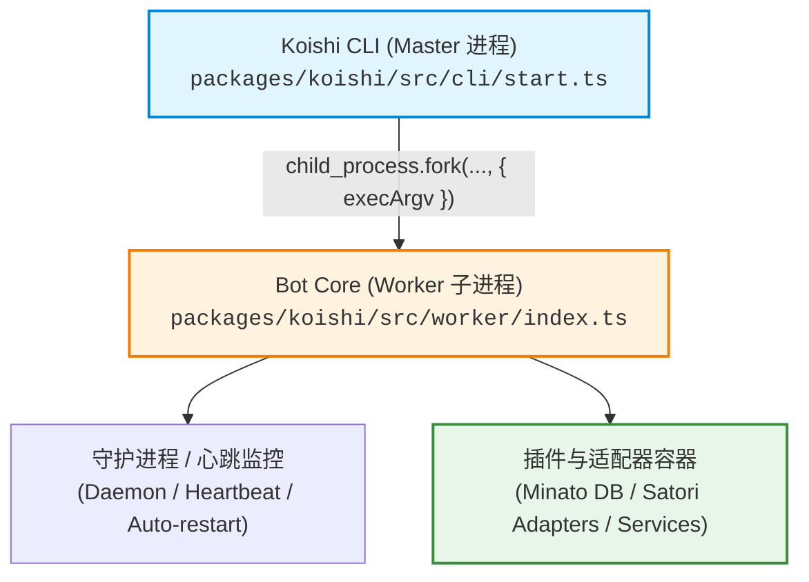

# Koishi & Cordis 开发者调试指南与启动手册 (Dev Debug Playbook)

本指南针对 Koishi 及底层 Cordis 框架的开发与排错，提供从**进程架构解析**、**日志追踪模型**、**CLI 调试参数**到 **VS Code 源码断点调试**的完整操作手册与避坑指南。

---

## 1. 核心架构与调试模型 (Architecture & Debug Model)

Koishi 运行在 **Master-Worker 多进程模型**之下：



### 1.1 核心调试陷阱：主进程 vs 子进程
- 当直接执行 `node --inspect node_modules/.bin/koishi start` 时，Node V8 Inspector 仅附加在 **Master 进程** 上。
- **业务代码、插件生命周期、适配器通信和数据库查询都在 Worker 子进程内运行**。若断点打在插件或加载器逻辑中，断点将无法命中。
- **解决方案**：Koishi CLI 的 `start` 命令会将未知参数自动转换为子进程的 `execArgv`。因此，通过 `npx koishi start --inspect` 或 `--inspect-brk` 可以将调试参数透传至 Worker 子进程。

---

## 2. 日志级别与命名空间过滤 (Logger & Namespace Model)

Koishi 内置基于 `reggol` 的分级日志系统，支持细粒度命名空间过滤。

### 2.1 日志级别对照表

| Level | 名称 | 场景说明 | 触发方式 |
| :--- | :--- | :--- | :--- |
| **0** | `SILENT` | 关闭所有输出 | `--log-level 0` |
| **1** | `ERROR` | 仅输出异常崩溃与错误堆栈 | `--log-level 1` |
| **2** | `INFO / WARN` | **默认级别**。输出警告与关键运行信息 | 默认 |
| **3** | `DEBUG` | 输出调试明细、网络包负载、加载器流程 | `--log-level 3` 或 `--debug` |

### 2.2 命名空间过滤 (`--debug`)

无需开启全局 `DEBUG` 产生大量噪音日志，可通过逗号分隔指定关心的模块命名空间：

```bash
# 仅开启 loader 与 app 相关的详细调试输出
npx koishi start --debug app,loader

# 追踪网络请求与适配器通信
npx koishi start --debug http,adapter,satori

# 追踪数据库底层 SQL / 操作
npx koishi start --debug minato

# 开启所有命名空间调试输出
npx koishi start --debug *
```

### 2.3 常用日志环境变量

```bash
# 开启时间戳输出
export KOISHI_LOG_TIME=true

# 设置日志过滤级别 (0-3)
export KOISHI_LOG_LEVEL=3

# 设置调试命名空间
export KOISHI_DEBUG=app,loader,minato
```

---

## 3. CLI 快速启动与调试 SOP (Standard Operating Procedures)

### SOP 0：一键启动脚本 (Yarn Scripts Shortcuts)
在 `package.json` 中已配置快捷启动脚本，无需手动拼接长命令：

```bash
# 启动热重载开发模式（包含 hmr, app, loader 调试日志）
yarn dev

# 启动调试模式（开启 9229 端口 Inspector，可供 VS Code 附加断点）
yarn debug

# 启动首行暂停调试（等待调试器连接后再开始加载插件）
yarn debug:brk
```

### SOP 1：全详细日志模式启动 (Verbose Debug Mode)
在排查配置加载或插件初始化失败时使用：

```bash
# 启动本地 koishi 实例，显示时间戳、Level 3 日志以及核心命名空间追踪
npx koishi start --log-level 3 --log-time --debug app,loader
```

### SOP 2：Node.js V8 远程调试 (Chrome DevTools / Edge)
用于在无 IDE 配置情况下直接利用浏览器 DevTools 抓取 Heap Snapshot 或打断点。

> [!WARNING]
> **关于参数传递格式的特别说明**：
> Node.js 的 `--inspect` 语法要求参数必须紧随等号（如 `--inspect=0.0.0.0:9229`），不支持空格分隔。
> Koishi CLI 内部对未识别参数会拆分成 `[key, value]` 数组传递给 Worker，导致 Node 将其解析为单独的参数并误认为是要执行的脚本文件（报错 `Cannot find module '0.0.0.0:9229'`）。
> **因此，指定自定义 IP/端口时，务必在 `--` 后传递**；如果使用默认端口，直接使用 `--inspect` 即可。

```bash
# 方式 A：自定义 IP/端口（务必在 -- 之后传递）
npx koishi start -- --inspect=0.0.0.0:9229

# 方式 B：首行暂停（在 -- 之后传递）
npx koishi start -- --inspect-brk=0.0.0.0:9229

# 方式 C：使用默认端口 (127.0.0.1:9229)
npx koishi start --inspect
```
**接入调试器**：
1. 打开 Chrome / Edge 浏览器，访问 `chrome://inspect`。
2. 点击 **Configure...**，确认添加了 `localhost:9229`（或远程服务器 IP:9229）。
3. 在 **Remote Target** 列表中找到 Worker 子进程并点击 **inspect**。

### SOP 3：开发免重启实时热重载 (Koishi Native HMR)
在开发插件或修改配置时，无需频繁重启机器人进程。通过内置的 [`@koishijs/plugin-hmr`](file:///data/koishi/plugins/hmr) 插件即可实现模块级热替换。

1. **在 `koishi.yml` 中启用 `hmr` 插件**：
   ```yaml
   prefix:
     - '!'
   plugins:
     hmr:
       root:
         - plugins
         - koishi.yml
     mock: {}
     echo: {}
     help: {}
   ```

2. **启动并监听热重载日志**：
   ```bash
   npx koishi start --debug hmr,app,loader
   ```
   修改 `plugins/` 目录下的任何插件源码或 `koishi.yml` 配置，Koishi 会自动按拓扑依赖重新卸载并挂载插件，状态平滑热重载。

> [!NOTE]
> **关于 `external/boilerplate` 的说明**：
> `external/boilerplate` 子模块属于上游 Cordis v4 实验线（要求 `cordis: ^4.0.0-rc.7`），而当前根仓库固定解析为本地 `external/cordis` (v3.18.1)，跨代调用会触发 `SyntaxError: The requested module 'cordis' does not provide an export named 'DisposableList'`。在当前仓库开发时，请使用上述内置的 Koishi HMR 方案。


---

## 4. VS Code 深度集成配置 (launch.json & 断点调试)

在项目根目录 `.vscode/launch.json` 中添加以下配置，即可在 VS Code 中实现源码断点（支持命中 `.ts` 文件）：

```json
{
  "version": "0.2.0",
  "configurations": [
    {
      "name": "Koishi: Start with Debugger (Auto Child Fork)",
      "type": "node",
      "request": "launch",
      "runtimeExecutable": "node",
      "runtimeArgs": [
        "${workspaceFolder}/packages/koishi/bin.js",
        "start",
        "--inspect",
        "--log-level",
        "3",
        "--log-time"
      ],
      "cwd": "${workspaceFolder}",
      "console": "integratedTerminal",
      "restart": false,
      "autoAttachChildProcesses": true,
      "sourceMaps": true
    },
    {
      "name": "Cordis Boilerplate: Dev Mode (TSX + HMR)",
      "type": "node",
      "request": "launch",
      "runtimeExecutable": "yarn",
      "runtimeArgs": [
        "workspace",
        "@cordisjs/boilerplate",
        "dev"
      ],
      "cwd": "${workspaceFolder}",
      "console": "integratedTerminal",
      "internalConsoleOptions": "neverOpen",
      "autoAttachChildProcesses": true,
      "sourceMaps": true
    },
    {
      "name": "Attach to Running Worker (Port 9229)",
      "type": "node",
      "request": "attach",
      "port": 9229,
      "restart": true,
      "sourceMaps": true
    }
  ]
}
```

---

## 5. 调试环境最小化验证配置 (`koishi.yml`)

若要在本地快速起动并单步调试核心插件，在根目录创建最小化验证配置 `koishi.yml`：

```yaml
# koishi.yml
prefix:
  - '!'

# 全局日志设置
logger:
  showTime: "yyyy-MM-dd hh:mm:ss"
  showDiff: true
  levels:
    base: 3 # 输出 DEBUG 级日志

plugins:
  # mock 适配器：无需真实第三方通讯协议，通过控制台模拟会话输入
  mock: {}

  # 常用官方插件
  echo: {}
  help: {}
```

启动命令：
```bash
npx koishi start koishi.yml --debug app,loader,plugin
```

---

## 6. 常见故障排错速查 (Troubleshooting Checklist)

### Q1: 断点显示灰色 Unbound Breakpoint（未绑定）
- **原因**：TypeScript 编译产物缺少 Source Map，或产物路径与工作区映射脱节。
- **解决方式**：
  1. 确保构建带有 source map：执行 `yarn compile` 或 `yarn build`。
  2. 确认在 `.vscode/settings.json` 中配置了 `"typescript.preferGoToSourceDefinition": true`。

### Q2: 调试时触发 `daemon: heartbeat timeout` 导致进程被杀
- **原因**：当断点长时间停留在 Worker 线程时，Master 与 Worker 之间的 IPC 心跳无法及时应答，Master 守护进程会将挂起的子进程作为僵死进程终止。
- **解决方式**：
  - 启动时通过配置调大或关闭心跳超时，在 `koishi.yml` 中配置：
    ```yaml
    daemon:
      heartbeatTimeout: 0 # 0 表示关闭心跳超时检测
    ```
  - 或者使用 Cordis 模式（单进程调试），避免 Master 进程心跳杀进程。

### Q3: 端口冲突 `EADDRINUSE 9229`
- **原因**：Master 进程和 Worker 进程同时尝试抢占固定 Inspector 端口。
- **解决方式**：使用 `--inspect=0`，让 Node 自动分配空闲端口，并配合 VS Code `autoAttachChildProcesses`。
