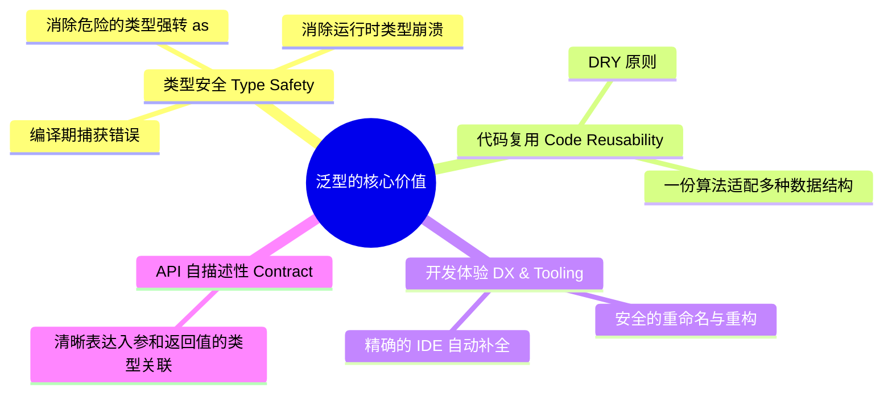
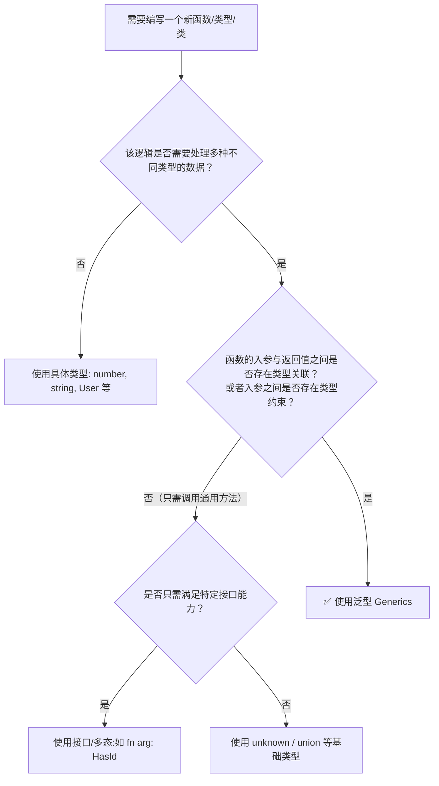

# 深入解析泛型编程：价值、权衡与实践指南

## 1. 什么是泛型（Generics）？

在强类型编程语言（如 TypeScript, Rust, Go, Java, C++ 等）中，**泛型（Generics）**，即**参数化多态（Parametric Polymorphism）**，允许我们在定义函数、接口、类或类型别名时，**将“类型”本身作为参数传入**，待调用或实例化时再确定具体的类型。

简单来说：
* **普通函数参数**：传递的是**运行时的具体数值**（`x: 10`, `name: "Alice"`）。
* **泛型类型参数**：传递的是**编译时的类型信息**（`T: number`, `T: User`）。

---

## 2. 为什么需要泛型？核心解决的问题与对比

为了直观理解泛型的不可替代性，我们通过三个日常典型场景进行对比：

### 场景一：容器与返回值类型丢失问题

假设我们需要一个函数，返回传入的第一个元素：

```typescript
// 方案 A：针对特定类型重复编写（违反 DRY 原则）
function firstString(arr: string[]): string { return arr[0]; }
function firstNumber(arr: number[]): number { return arr[0]; }

// 方案 B：使用 any（彻底丢失类型安全，IDE 无法补全）
function firstAny(arr: any[]): any { return arr[0]; }
const itemA = firstAny(["hello", "world"]); // itemA 类型为 any，调用 itemA.toFixxx() 不会报错但运行时崩溃

// 方案 C：使用泛型（逻辑复用 + 严格类型安全）
function first<T>(arr: T[]): T | undefined { return arr[0]; }
const item = first(["hello", "world"]); // item 类型自动推导为 string
item.toUpperCase();                     // ✅ IDE 智能感知与编译检查全部保留
```

---

### 场景二：对象属性与键关联（以 Cosmokit 工具库为例）

在类似 `cosmokit` 的基础设施中，如果要在对象上动态安全地挂载属性：

```typescript
// 没有泛型约束：键与值完全脱节
function setProp(obj: object, key: string, value: any) {
  obj[key] = value;
}

// 使用泛型约束（K 必须属于 T 的键，且 value 的类型必须等于 T[K]）
export function defineProperty<T, K extends keyof T>(object: T, key: K, value: T[K]): T {
  return Object.defineProperty(object, key, { writable: true, value, enumerable: false });
}

interface UserConfig {
  timeout: number;
  retries: number;
}

const config: UserConfig = { timeout: 1000, retries: 3 };

// ✅ 编译通过：timeout 对应的类型是 number
defineProperty(config, 'timeout', 2000);

// ❌ 编译报错：'invalid' 不属于 UserConfig，拼写错误被即时捕获
defineProperty(config, 'timout', 2000);

// ❌ 编译报错：'5000' 是 string，不符合 UserConfig['timeout'] 的 number 类型
defineProperty(config, 'timeout', '5000');
```

---

### 场景三：异步与响应式状态流（Promise / Observable）

现代前端与后端开发中无处不在的 `Promise<T>`、`Ref<T>` 或 `Observable<T>`：

```typescript
interface ApiResponse<TData> {
  code: number;
  message: string;
  data: TData;
}

async function fetchUser(): Promise<ApiResponse<{ id: string; name: string }>> {
  // ...
}

const res = await fetchUser();
console.log(res.data.name); // ✅ data 的内部结构被完整保留，无需任何手动 as 强转
```

---

## 3. 泛型的核心优势与价值（Pros）



1. **编译期类型安全（Compile-Time Safety）**：
   在代码编译阶段就能发现潜在类型不匹配问题，彻底消除使用 `any` 带来的隐式类型漏洞。
2. **高内聚与代码复用（Code Reusability & DRY）**：
   无需为 `User`、`Order`、`Product` 分别写多套增删改查逻辑，一套泛型分页、筛选、缓存组件即可服务所有实体。
3. **消除繁琐与危险的类型断言（Eliminate Type Casting）**：
   避免代码中充斥 `(data as User).name` 这种无法被静态分析保障的代码。
4. **极致的开发者体验（Enhanced DX & Intellisense）**：
   输入函数参数时，IDE 能够根据前面的参数反向推导后续参数的自动提示（如 `keyof T` 自动联想字段名）。

---

## 4. 泛型的代价与劣势（Cons & Pitfalls）

虽然泛型非常强大，但盲目滥用也会带来明显的副作用：

| 痛点维度 | 具体表现 | 应对建议 |
| :--- | :--- | :--- |
| **心智负担与可读性** | 复杂的条件泛型（`T extends infer U ? ...`）和分布式类型犹如“类型体操”，极大降低业务代码可读性。 | 业务层尽量保持简单泛型（1~2个参数），复杂类型体操只限制在底层通用工具库。 |
| **编译性能开销** | 过于深层的泛型递归和嵌套推导会导致 TypeScript 编译变慢甚至出现 `Type instantiation is excessively deep` 错误。 | 避免在大型对象上做多层笛卡尔积或深度递归类型转换。 |
| **晦涩的报错信息** | 当泛型推导失败时，TypeScript 产生的错误堆栈可能长达数十行，难以快速定位根本原因。 | 使用明确的泛型约束（`extends`）缩小错误范围。 |
| **过度设计（Over-Engineering）** | 开发者往往在业务尚未出现复用需求时就过早泛型化，增加不必要的复杂度。 | 遵循三次法则（Rule of Three）：只有当同类逻辑出现第三次时才考虑抽象泛型。 |

---

## 5. 决策指南：什么时候应该使用泛型？

为了帮助团队快速决策是否应当引入泛型，可以参考以下判定法则：

### 决策流程图



### 黄金法则（Rule of Thumb）

> [!TIP]
> **泛型单次出现原则（Single-Occurrence Anti-Pattern）**：
> 如果一个泛型类型参数 `T` **只在函数签名中出现了一次**，并且没有用来推导或关联其他参数/返回值，那么**90% 的概率你不需要泛型**。
>
> ❌ **不必要的泛型**：
> ```ts
> function printName<T extends { name: string }>(item: T): void {
>   console.log(item.name);
> }
> ```
> ✅ **更简洁直接的写法**：
> ```ts
> function printName(item: { name: string }): void {
>   console.log(item.name);
> }
> ```

---

## 6. 最佳实践总结

1. **始终添加必要的边界约束（Generic Constraints）**：
   使用 `T extends string` 或 `K extends keyof T`，既能限制非法输入，又能提供更丰富的属性访问提示。
2. **合理提供默认泛型参数（Default Type Arguments）**：
   如 `Dict<T = any, K extends string = string>`，让最普遍的场景只需写 `Dict<number>` 或 `Dict`，降低使用门槛。
3. **分清应用层与框架层定位**：
   * **业务业务层（App/Business）**：以业务可读性为第一要务，优先使用具名类型、显式接口。
   * **基础设施/工具库层（Library/Framework）**：充分发挥泛型抽象能力，封装通用的集合操作、通信协议和类型工具。
