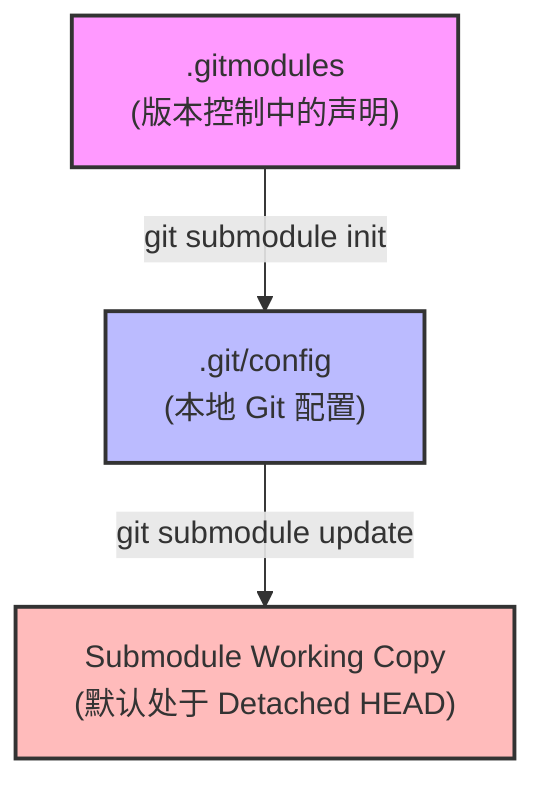

# Git Submodule 规范与故障避坑指南 (Git Submodule Playbook)

本指南针对 Monorepo 跨仓库依赖场景（如 `external/` 目录下的子模块）提供最佳实践与标准操作流程（SOP），帮助开发者规避 **Detached HEAD（游离头指针）**、**`.gitmodules` 与 `.git/config` 分支配置脱节** 以及 **子模块指针意外漂移** 等常见问题。

---

## 1. 核心问题根因分析 (Root Causes)



1. **游离头指针 (Detached HEAD)**
   - **机制**：父仓库仅记录子模块的特定 Commit Hash（如 `6d0f6f9`）。执行 `git submodule update` 时，Git 默认直接检出该 Hash，而不绑定到任何本地分支。
   - **危害**：在子模块中修改代码并提交后，一旦切换分支或更新父仓库，未绑定分支的提交容易丢失或悬空。

2. **配置不同步 (`.gitmodules` vs `.git/config`)**
   - **机制**：`.gitmodules` 中声明了 `branch = safe-dev` / `branch = v4`，但 `git submodule init` / `git submodule sync` 默认只同步 `url`，不会自动将 `branch` 字段写入 `.git/config`。
   - **危害**：`git submodule update --remote` 行为异常，或本地分支与声明分支脱钩。

3. **本地分支落后于父仓库固定 Commit**
   - 父仓库推进了子模块的 Commit 指针，但子模块的同名本地分支未自动 fast-forward，导致本地分支落后（behind）。

---

## 2. 预防规范与最佳实践 (Best Practices)

### 规则 1：子模块日常维护必须“分支优先” (Branch First)
在子模块内修改或拉取代码前，务必先检出目标分支，严禁在 Detached HEAD 状态下直接提交代码：
```bash
# 进入子模块目录
cd external/<submodule_name>

# 切换到对应开发分支并同步最新提交
git checkout <branch_name>
git pull origin <branch_name>
```

### 规则 2：确保本地 `.git/config` 完整同步分支跟踪
初始化或克隆仓库后，将 `.gitmodules` 中的分支配置写入本地 Git 配置：
```bash
# 同步 URL 与分支映射配置
git submodule sync
git config submodule.external/satori.branch v4
git config submodule.external/minato.branch v3
git config submodule.external/cosmokit.branch master
git config submodule.external/cordis.branch safe-dev
git config submodule.external/boilerplate.branch main
```

---

## 3. 标准操作流程 (SOP)

### SOP 1：全新克隆与初始化
```bash
# 推荐克隆方式（递归克隆指定分支）
git clone --recursive -b dev https://github.com/Idlehanker/koishi.git

# 已有仓库初始化
git checkout dev
git submodule update --init --recursive
```

### SOP 2：一键对齐所有 Submodule 到配置分支
当发现子模块处于 Detached HEAD 或分支不对齐时，运行以下一键脚本恢复正常状态：
```bash
git submodule foreach '
  target_branch=$(git config -f $toplevel/.gitmodules submodule.$name.branch || echo "main");
  echo ">>> Aligning $name to branch $target_branch ...";
  git checkout $target_branch 2>/dev/null || git checkout -b $target_branch origin/$target_branch;
  git merge --ff-only origin/$target_branch 2>/dev/null || true;
'
```

### SOP 3：安全跟进上游最新提交 (Update to Remote)
当需要升级子模块依赖至远程分支最新版本时：
```bash
# 1. 根据 .gitmodules 跟踪的分支拉取最新代码
git submodule update --remote --merge

# 2. 确保子模块本地分支已 fast-forward
git submodule foreach '
  target_branch=$(git config -f $toplevel/.gitmodules submodule.$name.branch || echo "main");
  git checkout $target_branch;
  git merge --ff-only origin/$target_branch 2>/dev/null || true;
'

# 3. 在父仓库中提交指针变动
git add external/
git commit -m "chore(submodules): update dependencies to latest tracking branches"
```

### SOP 4：在子模块中开发并提交代码
```bash
# 1. 进入子模块并确保在目标分支
cd external/cordis
git checkout safe-dev

# 2. 修改代码并提交
git add .
git commit -m "feat(core): add new feature"

# 3. 先推送到子模块远程仓库
git push origin safe-dev

# 4. 返回父仓库并提交子模块指针更新
cd /data/koishi
git add external/cordis
git commit -m "chore(cordis): bump commit pointer"
git push origin dev
```

---

## 4. 诊断与排错命令速查 (Cheat Sheet)

| 场景 / 需求 | 命令 | 说明 |
| :--- | :--- | :--- |
| **检查所有子模块当前分支与 HEAD** | `git submodule foreach 'git branch -vv'` | 重点检查是否存在 `(HEAD detached ...)` |
| **检查父仓库记录的子模块 Commit** | `git submodule status` | 检查前缀是否有 `+` (未提交的指针变更) 或 `-` (未初始化) |
| **检查 `.git/config` 分支配置** | `git config --get-regexp '^submodule\..*\.branch'` | 确保每个子模块均配置了目标分支 |
| **查看子模块差异详细信息** | `git diff --submodule=diff` | 查看子模块内部代码改动的具体 Diff |
| **修复单子模块 Detached HEAD** | `git -C external/<dir> checkout <branch> && git -C external/<dir> merge --ff-only origin/<branch>` | 将特定子模块恢复到本地跟踪分支 |
