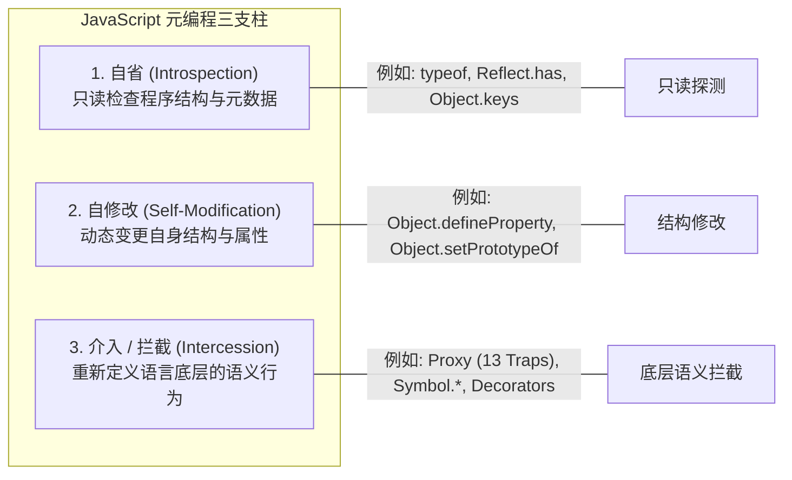
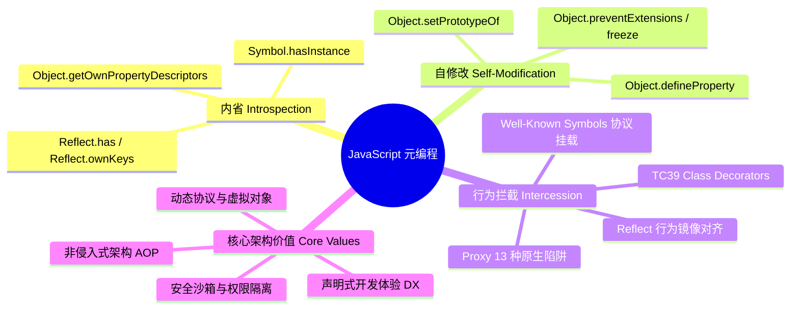
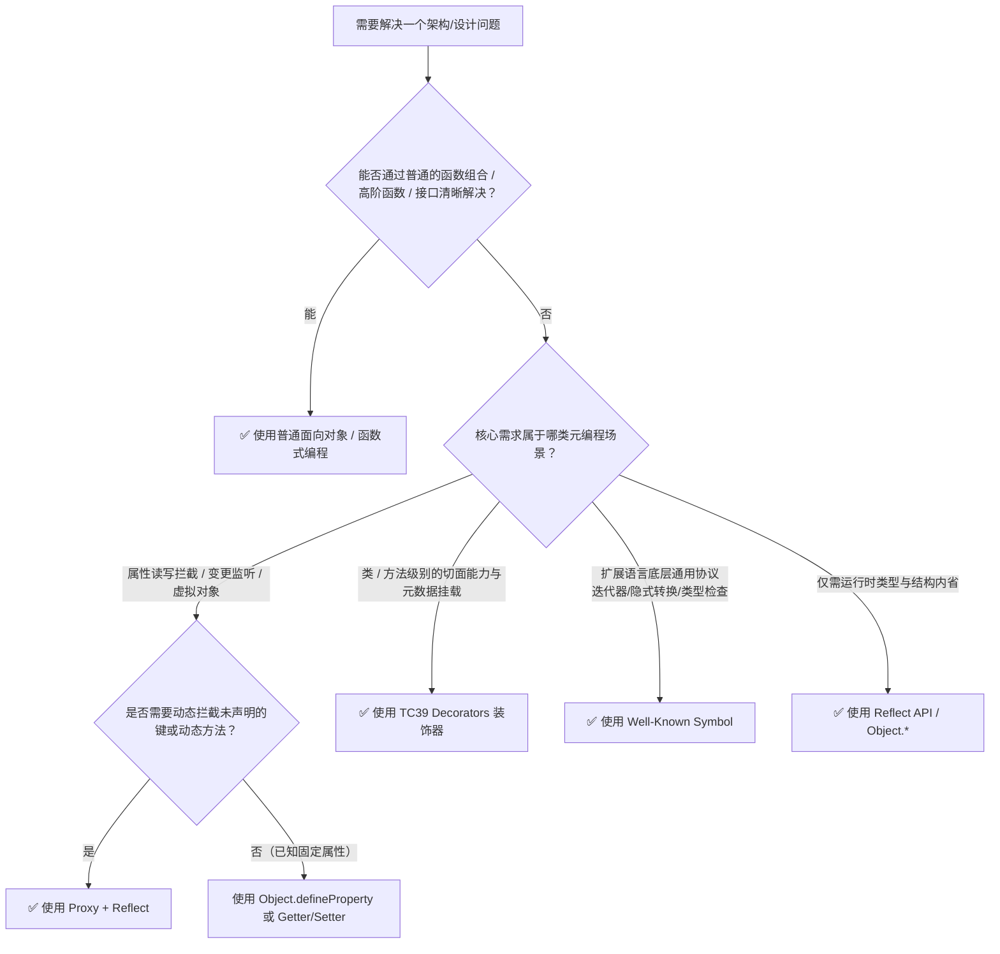

# 深入解析 JavaScript 元编程：机制、范式与实战手册

## 1. 什么是元编程（Metaprogramming）？

在计算机科学中，**元编程（Metaprogramming）** 是指**编写能够读取、生成、分析或转换其他程序，甚至在运行时修改自身行为的程序**。简单来说，如果普通编程是在编写操作“数据”的代码，那么元编程就是在编写**操作“代码本身”的代码**。

在 JavaScript (ECMAScript 6+) 的语境下，元编程主要分为三个层次：



* **普通编程（Base Level）**：关注业务数据的处理，如 `user.name = "Alice"`、`calculateTotal(cart)`。
* **元编程（Meta Level）**：关注语言底层对象模型与操作行为的控制，如“当用户读取任何未定义的属性时动态转发 RPC 请求”、“拦截私有状态并自动收集响应式依赖”。

---

## 2. 为什么需要元编程？核心解决的问题与典型场景

元编程是现代前端框架（如 Vue 3、MobX、SolidJS）、Node.js 底层工具库（如 Koishi、Cordis、Prisma）以及 ORM/RPC 基础设施的核心驱动力。我们通过四个典型场景进行深入剖析：

### 场景一：透明拦截与深度响应式系统（Reactivity & Change Tracking）

现代响应式框架需要精确监听对象属性的读取与修改，以实现依赖收集和自动更新。

```typescript
// 方案 A：传统 Object.defineProperty（Vue 2 方案）
function reactiveLegacy(obj: Record<string, any>, onChange: () => void) {
  for (const key of Object.keys(obj)) {
    let internalVal = obj[key]
    Object.defineProperty(obj, key, {
      get() { return internalVal },
      set(newVal) {
        internalVal = newVal
        onChange()
      },
    })
  }
  return obj
}
const stateLegacy: any = reactiveLegacy({ count: 0 }, () => console.log('更新 UI'))
stateLegacy.newProp = 'val' // ❌ 动态新增的属性无法被拦截，必须依赖 Vue.set()
delete stateLegacy.count    // ❌ 属性删除无法被拦截

// 方案 B：元编程 Proxy + Reflect（Vue 3 / Koishi 方案）
function reactiveModern<T extends object>(target: T, onChange: (key: string | symbol) => void): T {
  return new Proxy(target, {
    get(target, prop, receiver) {
      const result = Reflect.get(target, prop, receiver)
      // 惰性深层代理（按需递归，极致性能）
      if (typeof result === 'object' && result !== null) {
        return reactiveModern(result, onChange)
      }
      return result
    },
    set(target, prop, value, receiver) {
      const oldValue = Reflect.get(target, prop, receiver)
      const success = Reflect.set(target, prop, value, receiver)
      if (success && oldValue !== value) {
        onChange(prop)
      }
      return success
    },
    deleteProperty(target, prop) {
      const success = Reflect.deleteProperty(target, prop)
      if (success) onChange(prop)
      return success
    },
  })
}
// ✅ 动态新增属性、删除属性、深层嵌套属性与数组变异均能透明拦截
```

---

### 场景二：语言协议扩展与众所周知符号（Well-Known Symbols）

ECMAScript 通过 `Symbol.*` 开放了引擎内部协议，允许开发者扩展 JavaScript 内置的原生行为（如迭代器、类型转换、实例判定）：

```typescript
// 自定义集合类，通过 Symbol 实现原生语言协议的无缝集成
class PriorityQueue<T> {
  private items: { priority: number; value: T }[] = []

  push(value: T, priority: number) {
    this.items.push({ priority, value })
    this.items.sort((a, b) => b.priority - a.priority)
  }

  // 1. 介入 for...of 迭代协议
  *[Symbol.iterator](): Iterator<T> {
    for (const item of this.items) {
      yield item.value
    }
  }

  // 2. 介入 Object.prototype.toString.call(queue) 类型标签
  get [Symbol.toStringTag](): string {
    return 'PriorityQueue'
  }

  // 3. 介入类型隐式转换协议 (String(queue), +queue)
  [Symbol.toPrimitive](hint: string): string | number {
    if (hint === 'number') return this.items.length
    return `[PriorityQueue size=${this.items.length}]`
  }

  // 4. 介入 instanceof 运算符
  static [Symbol.hasInstance](instance: any): boolean {
    return instance && typeof instance.push === 'function' && Array.isArray(instance.items)
  }
}

const pq = new PriorityQueue<string>()
pq.push('Task A', 1)
pq.push('Task B', 10)

// ✅ 语言原生语法无缝融合
for (const task of pq) { console.log(task) } // 输出: Task B, Task A
console.log(Object.prototype.toString.call(pq)) // 输出: [object PriorityQueue]
console.log(+pq)                              // 输出: 2
console.log({ items: [], push() {} } instanceof PriorityQueue) // 输出: true
```

---

### 场景三：面向切面编程与装饰器（AOP & TC39 Stage 3 Decorators）

在不修改核心业务逻辑的前提下，通过装饰器注入日志追踪、耗时统计、参数校验与缓存（Memoization）：

```typescript
// 标准 TC39 Stage 3 装饰器：自动度量方法执行耗时
function measureTime<This, Args extends any[], Return>(
  target: (this: This, ...args: Args) => Return,
  context: ClassMethodDecoratorContext<This, (this: This, ...args: Args) => Return>
) {
  const methodName = String(context.name)

  return function (this: This, ...args: Args): Return {
    const start = performance.now()
    try {
      const result = target.call(this, ...args)
      // 兼容同步与异步返回值
      if (result instanceof Promise) {
        return result.finally(() => {
          console.log(`[Metric] ${methodName} 耗时: ${(performance.now() - start).toFixed(2)}ms`)
        }) as Return
      }
      console.log(`[Metric] ${methodName} 耗时: ${(performance.now() - start).toFixed(2)}ms`)
      return result
    } catch (err) {
      console.error(`[Error] ${methodName} 异常:`, err)
      throw err
    }
  }
}

class PaymentService {
  @measureTime
  async processPayment(orderId: string, amount: number) {
    // 核心业务代码纯粹清爽，无需手动写 console.time
    await new Promise(resolve => setTimeout(resolve, 150))
    return { status: 'success', orderId }
  }
}
```

---

### 场景四：虚拟对象与动态 RPC 调度（Dynamic Invocation & Fluent DSL）

无需为每个服务端接口提前生成繁琐的 SDK，利用 `Proxy` 的 `get` 与 `apply` 陷阱动态拦截调用链路，将其转化为 HTTP/WebSocket 请求：

```typescript
// 动态 RPC 客户端工厂
function createRPCClient(baseUrl: string, path: string[] = []): any {
  return new Proxy(() => {}, {
    get(_target, prop: string) {
      if (prop === 'then') return undefined // 避免被 Promise 解析误判为 thenable
      return createRPCClient(baseUrl, [...path, prop])
    },
    async apply(_target, _thisArg, args) {
      const endpoint = `${baseUrl}/${path.join('/')}`
      console.log(`[RPC Dispatch] 发送请求: POST ${endpoint}`, { body: args[0] })
      // 模拟网络请求
      return { code: 200, endpoint, payload: args[0] }
    },
  })
}

const api = createRPCClient('https://api.example.com/v1')

// ✅ 任意路径与方法调用均由 Proxy 动态解析，无需声明具体的客户端类
await api.users.getById({ id: 1001 })      // -> POST https://api.example.com/v1/users/getById
await api.billing.invoices.create({ amount: 500 }) // -> POST https://api.example.com/v1/billing/invoices/create
```

---

## 3. 元编程的核心支柱与关键价值（Pros & Architectural Pillars）



1. **非侵入式架构与职责分离（Non-Invasive AOP）**：
   将横切关注点（安全鉴权、审计日志、分布式追踪、缓存控制）从业务代码中剥离，保持业务模型高度纯粹。
2. **极致的声明式开发体验（Declarative DX & DSL）**：
   允许库作者创造接近自然语言或高度直观的 API（如 `@Column()`, `@Inject()`, `ctx.observe()`），大幅减少样板代码。
3. **动态适应与虚拟化（Virtualization & Dynamic Bridging）**：
   无需静态定义所有方法与属性，借助 Proxy 可以在运行时根据请求即时生成行为（RPC、ORM 链式查询、Mock 框架）。
4. **安全沙箱与隔离控制（Sandboxing & Membrane Pattern）**：
   结合 `Proxy.revocable` 与膜模式（Membrane），可以实现对第三方插件或外部脚本的属性访问控制与即时权限吊销。

---

## 4. 元编程的代价与劣势（Cons & Pitfalls）

元编程如同锋利的手术刀，在提供强大表现力的同时，也伴随着显著的工程与性能风险：

| 痛点维度 | 具体表现 | 应对建议 |
| :--- | :--- | :--- |
| **V8 JIT 优化破坏与性能开销** | Proxy 拦截会绕过 V8 引擎的高速内联缓存（Inline Cache）和隐藏类优化（Hidden Classes），微基准测试中属性访问比原生慢 3~10 倍。 | 避免在紧凑循环（Hot Paths）或图形计算中过度使用 Proxy；优先在框架边界层进行代理。 |
| **内部插槽与私有字段失效** | 原生内置对象（`Map`, `Set`, `Date`, `Promise`）依赖引擎内部插槽（`[[MapData]]`），通过 Proxy 访问时若 `this` 指向代理而非原始对象会抛出 `TypeError: Method called on incompatible receiver`。私有字段（`#field`）同理。 | 在 Proxy 的 `get` 陷阱中对方法进行 `bind` 修复，或解包原始目标（Unwrap Target）。 |
| **代码可读性与调试黑盒** | 行为被隐式重载后，代码执行路径难以通过静态阅读推断，断点调试时调用栈充斥拦截层（Traps），错误信息晦涩。 | 坚持“显式优于隐式”，为动态代理对象保留显式的标识（如 Symbol 标识符）以便于 DevTools 排查。 |
| **违背对象不变量（Invariant Violations）** | ECMAScript 规范对 Proxy 施加了严格的不变量校验（例如：不可配置不可写的属性，Proxy 的 `get` 必须返回目标对象的真实值，否则直接抛出运行时异常）。 | Proxy 内部必须严格使用 `Reflect` 对应 API 转发，切勿脱离规范自定义虚假返回值。 |
| **原型链污染与安全漏洞** | 随意使用 `Object.setPrototypeOf` 或递归修改原型链，不仅会导致全引擎范围内的优化失效，还可能引发原型链污染安全攻击。 | 冻结原型或使用 `Object.create(null)` 创建无原型字典，严禁动态修改不可信对象的原型。 |

---

## 5. 决策指南：什么时候应该使用元编程？

### 决策流程图



### 黄金法则（Rules of Thumb）

> [!TIP]
> 1. **最小介入原则（Principle of Least Intercession）**：
>    能用普通的**高阶函数（Higher-Order Functions）**解决的问题，绝不引入**装饰器（Decorators）**；能用装饰器解决的问题，绝不引入 **`Proxy`**。
>
> 2. **Proxy + Reflect 必须成对出现（The Golden Pair Rule）**：
>    任何 `Proxy` 拦截逻辑中，只要需要将操作透传给底层目标，**必须使用对应的 `Reflect` 方法并传入 `receiver`**，以保证原型链继承中 `getter/setter` 的 `this` 上下文不被破坏。
>
> 3. **元数据隔离原则（Metadata Isolation）**：
>    避免在对象上随意通过字符串 Key 挂载内部状态，统一使用 `WeakMap` 或私有 `Symbol` 作为存储媒介，防止命名冲突与内存泄漏。

---

## 6. 最佳实践与核心模式落地（Implementation Recipes）

### Recipe 1：解决 Proxy 内部插槽（Internal Slots）与私有字段（Private Fields）陷阱

针对 `Map/Set/Date` 以及 ECMAScript 私有字段 `#private` 在 Proxy 中可能触发的 `TypeError`，标准生产级防御范式如下：

```typescript
function safeProxy<T extends object>(target: T): T {
  return new Proxy(target, {
    get(target, prop, receiver) {
      const value = Reflect.get(target, prop, receiver)
      
      // 如果读取的是函数（例如 Map.prototype.get / set），
      // 必须将函数绑定回原始 target，以确保内部插槽 [[MapData]] 校验通过
      if (typeof value === 'function') {
        return value.bind(target)
      }
      return value
    },
  })
}

const rawMap = new Map<string, number>()
const proxyMap = safeProxy(rawMap)

// ✅ 成功执行，不会抛出 "TypeError: Method Map.prototype.set called on incompatible receiver"
proxyMap.set('count', 100)
console.log(proxyMap.get('count')) // 输出: 100
```

---

### Recipe 2：保持继承链路的 `receiver` 正确传递

当对象 A 继承自代理对象 B 时，必须确保 `Reflect.get(target, prop, receiver)` 中的 `receiver` 正确传递，否则 `this` 绑定将发生偏移：

```typescript
const parent = {
  _value: 'parent',
  get value() {
    return this._value
  },
}

const parentProxy = new Proxy(parent, {
  get(target, prop, receiver) {
    console.log(`[Intercepted] 读取属性: ${String(prop)}`)
    // 正确传递 receiver：当 child 访问继承的 value 时，this 正确指向 child 而非 parent
    return Reflect.get(target, prop, receiver)
  },
})

const child = Object.create(parentProxy)
child._value = 'child'

// ✅ 输出: [Intercepted] 读取属性: value -> 最终返回 'child'
// ❌ 若未使用 Reflect.get 或丢失 receiver，将错误返回 'parent'
console.log(child.value)
```

---

### Recipe 3：撤销式代理与资源生命周期回收（Revocable Proxy & Membrane）

在插件化系统或临时沙箱中，使用 `Proxy.revocable` 实现用完即废的安全隔离屏障：

```typescript
function createSandboxedPlugin(pluginApi: Record<string, any>) {
  const { proxy, revoke } = Proxy.revocable(pluginApi, {
    get(target, prop, receiver) {
      console.log(`[Plugin Access] ${String(prop)}`)
      return Reflect.get(target, prop, receiver)
    },
  })

  return {
    sandboxedApi: proxy,
    dispose: () => {
      // 吊销代理权限
      revoke()
      console.log('[Security] 插件 API 访问权限已被撤销')
    },
  }
}

const { sandboxedApi, dispose } = createSandboxedPlugin({ doAction: () => 'executed' })
console.log(sandboxedApi.doAction()) // 正常执行 -> 'executed'

dispose()
// ❌ 抛出 TypeError: Cannot perform 'get' on a proxy that has been revoked
try {
  sandboxedApi.doAction()
} catch (e) {
  console.log('✅ 安全生效：已成功阻止卸载后的插件继续调用 API')
}
```

---

### Recipe 4：应用分层落地规范

1. **应用业务层（Application / Business Layer）**：
   * 优先保持代码显式与静态类型完备。
   * 仅限使用成熟的装饰器（如参数校验 `@Validate()`, 事务控制 `@Transactional()`）。
   * 杜绝隐式修改原型或全局对象行为。
2. **底层基础设施层（Framework / Infra Layer）**：
   * 充分利用 `Proxy`、`Reflect` 与 `Symbol` 打造高表现力抽象（如微内核插件机制、依赖注入容器、ORM 状态变异追踪）。
   * 严格处理不可变契约、私有字段兼容性与 V8 性能优化边界。
