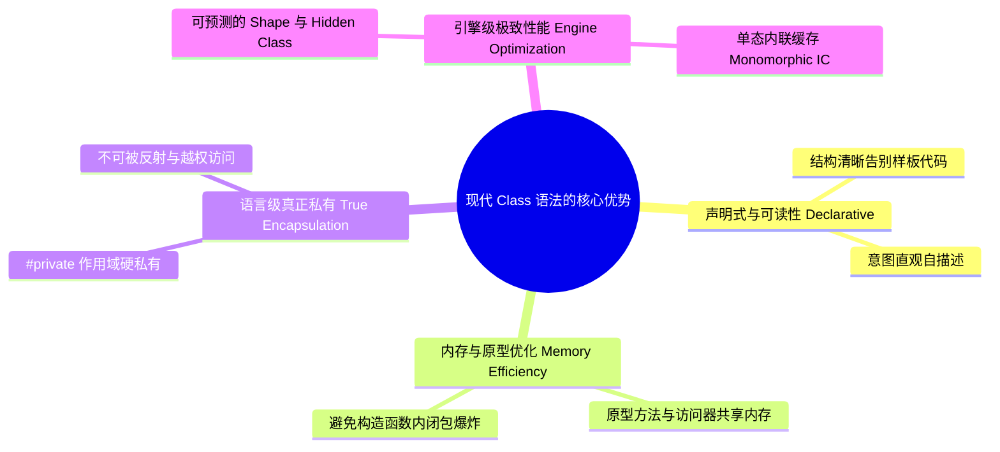
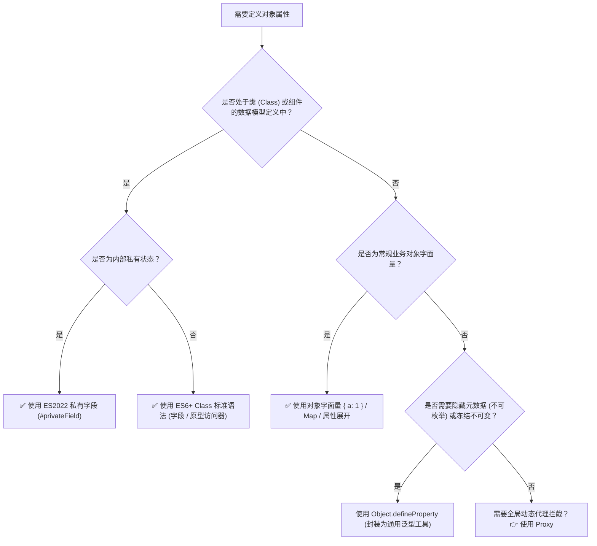

# 深入解析 JavaScript 属性定义：范式演进、底层权衡与避坑指南

## 1. 什么是 JavaScript 属性定义？

在 JavaScript (ECMAScript) 中，对象的**属性定义（Property Definition）**经历了从早期简单的键值赋值，到 ES5 的底层属性描述符元编程，再到现代 ES6+ / ES2022 声明式类模型的深度演化。

简单来说：
* **普通赋值（`[[Set]]` 语义）**：传递运行时的值（`obj.x = 1`, `this.x = 1`），属于高级动态行为，会受原型链上的 Setter 拦截与只读特性影响。
* **属性描述符（`[[Define]]` 语义）**：通过 `Object.defineProperty` 或 ES2022 类字段（`x = 1`），直接在目标对象自身创建/重定义属性（Own Property），完全绕过原型链。
* **原型访问器与硬私有槽**：通过 ES6 原型方法/Getter/Setter 实现内存共享，通过 ES2022 `#privateField` 实现语言级硬隔离。

---

## 2. 为什么需要区分不同定义方式？核心解决的问题与对比

为了直观理解现代声明式类与底层 `Object.defineProperty` 的本质差异，我们通过三个日常典型场景进行对比：

### 场景一：原型链 Setter 意外劫持与赋值污染问题

假设我们在原型上定义了一个数据校验器或响应式拦截器：

```javascript
const userPrototype = {
  set role(newRole) {
    console.log("-> 原型 Setter 拦截触发，尝试校验:", newRole);
    // 假设此处抛出异常或进行特殊格式化
  }
};

// 方案 A：使用普通赋值（[[Set]] 语义，被原型 Setter 劫持）
const userA = Object.create(userPrototype);
userA.role = "admin"; 
// ❌ 输出了原型 Setter 日志，且 userA 自身没有 'role' 属性 (Object.hasOwn(userA, 'role') 为 false)

// 方案 B：使用 Object.defineProperty（[[Define]] 语义，繁琐命令式）
const userB = Object.create(userPrototype);
Object.defineProperty(userB, 'role', {
  value: 'admin',
  writable: true,
  enumerable: true,
  configurable: true
});
// ✅ 绕过原型 Setter，在 userB 自身安全创建属性 (代码冗长且易漏配描述符)

// 方案 C：使用现代 ES2022 类字段（[[Define]] 语义，声明式与安全兼备）
class AdminUser {
  role = "admin"; // 底层天然采用 [[Define]] 语义，杜绝原型污染
}
const userC = new AdminUser();
// ✅ 简洁直观，自身安全拥有 'role' 属性
```

---

### 场景二：实例内存冗余与构造函数闭包陷阱

当我们需要为每一个实例提供计算属性（Getter）或方法时：

```javascript
// 方案 A：在构造函数中通过 Object.defineProperty 动态挂载（内存灾难）
function LegacyUser(name) {
  this.name = name;
  // ❌ 每次 new 都会在堆内存中重新创建一个全新的闭包函数与描述符对象
  Object.defineProperty(this, 'displayName', {
    get() { return `User: ${this.name}`; },
    enumerable: true,
    configurable: true
  });
}
const u1 = new LegacyUser("Alice");
const u2 = new LegacyUser("Bob");
console.log(Object.getOwnPropertyDescriptor(u1, 'displayName').get === 
            Object.getOwnPropertyDescriptor(u2, 'displayName').get); // false (内存浪费)

// 方案 B：使用 ES6 Class 声明式访问器（原型共享，内存最优）
class ModernUser {
  constructor(name) {
    this.name = name;
  }
  // ✅ 自动挂载至 ModernUser.prototype，100万个实例只占用 1 份函数内存
  get displayName() {
    return `User: ${this.name}`;
  }
}
const m1 = new ModernUser("Alice");
const m2 = new ModernUser("Bob");
console.log(Reflect.getPrototypeOf(m1).displayName === Reflect.getPrototypeOf(m2).displayName); // true (内存共享)
```

---

### 场景三：真实私有性与封装防护（Symbol 伪私有 vs ES2022 `#` 硬私有）

当需要对敏感业务数据或安全 Token 进行私有封装时：

```javascript
// 方案 A：使用下划线命名约定（仅防君子，完全无防护）
class SoftPrivate {
  _token = "SECRET_123";
}
const s = new SoftPrivate();
console.log(s._token); // ❌ 外部直接读取修改

// 方案 B：使用 Object.defineProperty + Symbol / 不可配置描述符（仍可被反射攻破）
const fakeSecret = {};
const _key = Symbol("key");
Object.defineProperty(fakeSecret, _key, {
  value: "SECRET_123",
  writable: false,
  enumerable: false,
  configurable: false
});
// ❌ 仍然被反射轻松提取：
const leakedSymbol = Object.getOwnPropertySymbols(fakeSecret)[0];
console.log(fakeSecret[leakedSymbol]); // "SECRET_123"

// 方案 C：使用 ES2022 语法级私有字段 #private（不可穿透的硬私有）
class HardPrivate {
  #token = "SECRET_123";
  getToken() { return this.#token; }
}
const h = new HardPrivate();
console.log(Reflect.ownKeys(h)); // ✅ [] -> 外部与反射机制完全不可见
// console.log(h.#token);        // ❌ 语法级拦截：SyntaxError: Private field '#token' must be declared in an enclosing class
```

---

## 3. 现代 Class 声明式语法的核心优势（Pros）



1. **声明式抽象与开发体验（Declarative DX）**：
   彻底告别 `Object.defineProperty` 繁琐丑陋的字典配置样板代码，语义自解释，TypeScript 能够实现完美的静态类型推导。
2. **原型内存极致复用（Memory Sharing）**：
   方法与 Getter/Setter 天然收敛于 `ClassName.prototype`，杜绝因构造函数闭包定义导致的堆内存线性膨胀。
3. **语言级硬封装（Language-level Hard Encapsulation）**：
   基于 ECMAScript 规范的 `PrivateBrand` 内部槽机制，无论通过 `Object.keys()`、`Reflect.ownKeys()` 还是 `Proxy` 拦截都无法外泄私有字段。
4. **V8 引擎内联缓存加速（Fast Path & Monomorphic IC）**：
   在类构造期形成确定的 Hidden Class（Shape）转换链，触发 V8 TurboFan 单态内联缓存优化，属性读取性能媲美 C++ 结构体偏移访问。

---

## 4. 属性定义的核心陷阱与暗坑全景（Traps & Pitfalls）

虽然属性定义无处不在，但在复杂工程中极易踩入以下隐蔽暗坑：

| 痛点维度 | 具体表现 | 应对建议与最佳实践 |
| :--- | :--- | :--- |
| **描述符默认值陷阱** | `Object.defineProperty` 省略标志位时默认均为 `false`，导致属性意外变成只读、不可枚举、不可删除。 | 除非刻意需要只读/隐藏，否则必须显式写明 `writable: true, enumerable: true, configurable: true`。 |
| **浅拷贝抹除访问器** | 使用 `{ ...obj }` 或 `Object.assign()` 复制对象时，Getter 会被直接求值转化为静态普通属性，Setter 彻底丢失。 | 必须使用 `Object.defineProperties(target, Object.getOwnPropertyDescriptors(source))` 进行完整描述符克隆。 |
| **类字段覆盖父类访问器** | 子类直接声明 `field = 10` 会采用 `[[Define]]` 语义覆盖父类的 `get field() / set field()`，导致父类拦截逻辑完全失效。 | 若需继承父类 Getter/Setter，子类应在 `constructor` 内通过 `this.field = 10`（`[[Set]]` 语义）进行赋值。 |
| **闭包隐式内存泄漏** | 在 `defineProperty` 的 Getter/Setter 中意外捕获外部大对象或 DOM 节点，导致垃圾回收器（GC）无法释放内存。 | 避免在访问器描述符内跨作用域引用瞬态大对象；优先使用纯原型方法。 |

---

### 典型暗坑案例深度解析

#### 暗坑 1：`Object.defineProperty` 缺省描述符全为 `false` 灾难

```javascript
const config = {};
// 开发者往往以为这和 config.timeout = 1000 是一样的：
Object.defineProperty(config, 'timeout', { value: 1000 });

// 💥 灾难 1：无法修改（严格模式下报错 TypeError）
config.timeout = 2000; 
console.log(config.timeout); // 仍然是 1000！因为 writable 默认为 false

// 💥 灾难 2：序列化丢失
console.log(JSON.stringify(config)); // "{}"！因为 enumerable 默认为 false

// 💥 灾难 3：无法删除或重新配置
delete config.timeout; // false！因为 configurable 默认为 false
```

#### 暗坑 2：对象展开 `{ ...obj }` 与 `Object.assign` 破坏响应式访问器

```javascript
const reactiveState = {
  _val: 10,
  get val() { return this._val * 2; },
  set val(v) { this._val = v; }
};

// ❌ 错误克隆：展开运算符触发了 Getter 求值，生成了静态死数据
const clonedState = { ...reactiveState };
console.log(Object.getOwnPropertyDescriptor(clonedState, 'val'));
// 输出: { value: 20, writable: true, enumerable: true, configurable: true } -> 访问器彻底丢失！

// ✅ 正确克隆：完整复制原型与真实描述符
const accurateClone = Object.defineProperties(
  Object.create(Object.getPrototypeOf(reactiveState)),
  Object.getOwnPropertyDescriptors(reactiveState)
);
accurateClone.val = 30;
console.log(accurateClone.val); // 60 (Getter/Setter 完好保留)
```

#### 暗坑 3：ES2022 类字段对父类 Getter/Setter 的覆盖

```javascript
class BaseComponent {
  _enabled = false;
  get enabled() { return this._enabled; }
  set enabled(val) {
    console.log("-> 触发组件重绘逻辑");
    this._enabled = val;
  }
}

// ❌ 踩坑子类：字段声明具有 [[Define]] 语义
class BrokenChild extends BaseComponent {
  enabled = true; // 直接在自身创建 Own Property，完全遮蔽了父类的 Getter/Setter！
}
const child1 = new BrokenChild();
child1.enabled = false; // 没有任何日志输出！父类 Setter 彻底失效

// ✅ 正确写法：在构造器中使用 [[Set]] 语义赋值
class CorrectChild extends BaseComponent {
  constructor() {
    super();
    this.enabled = true; // 正常触发父类 set enabled()
  }
}
const child2 = new CorrectChild();
child2.enabled = false; // -> 正常输出: "-> 触发组件重绘逻辑"
```

---

## 5. 决策指南：什么时候使用哪种属性定义方式？

为了帮助团队在架构设计与日常开发中做出最优雅的技术选型，可以参考以下决策树：

### 决策流程图



### 黄金法则（Rule of Thumb）

> [!TIP]
> **现代属性定义黄金法则**：
> 1. **面向对象与数据建模**：**100% 优先使用 ES6+ Class 语法**，利用原型访问器实现逻辑封装，利用 `#` 实现真正私有。
> 2. **消除构造函数内 `defineProperty(this)` 反模式**：坚决禁止在构造函数内通过 `Object.defineProperty` 为 `this` 绑定方法或访问器。
> 3. **底层元编程受控使用**：仅在底层通用工具库中对已有对象注入**不可枚举元数据（Non-enumerable Tag）**或**深度冻结只读配置**时，才在封装良好的工具函数中使用 `Object.defineProperty`。

---

## 6. 最佳实践总结

1. **拥抱 Class 原型共享与 ES2022 字段语义**：
   充分发挥现代引擎对 Class 语法的优化能力，让方法和访问器留在原型，让数据字段保持确定顺序。
2. **警惕浅拷贝破坏访问器特性**：
   进行状态复制或克隆时，凡涉及 Getter/Setter 必须使用 `Object.getOwnPropertyDescriptors` 配合 `Object.defineProperties`。
3. **杜绝在业务代码中手写裸 `Object.defineProperty`**：
   若需注入不可枚举属性，应封装类似 `cosmokit` 的强类型工具函数（如 `defineProperty<T, K>(obj, key, value)`），避免描述符缺省 `false` 带来的隐蔽缺陷。
4. **弃用下划线伪私有，全面转向 `#` 语言级私有**：
   在需要严格数据防护与防逆向探测的场景中，使用 `#private` 彻底消除 Symbol 反射泄露风险。
