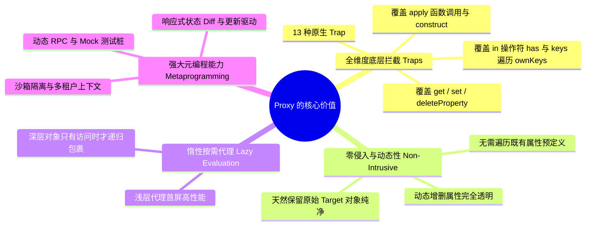
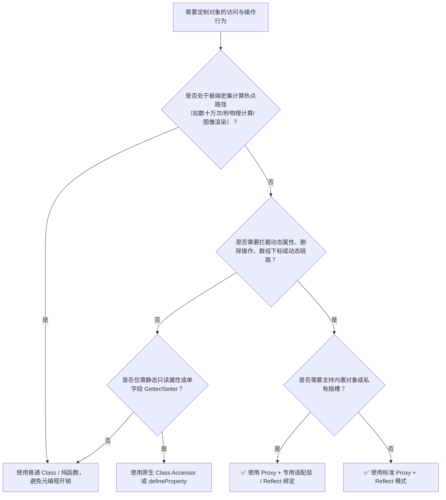

# 深入解析 JavaScript Proxy：机制、权衡与实战指南

## 1. 什么是 Proxy（元编程代理）？

在 JavaScript (ECMAScript 6+) 中，**`Proxy`（代理对象）** 是语言原生提供的**元编程（Metaprogramming）**核心机制。它允许开发者包装目标对象（Target），并在执行底层对象基本操作（如属性读取、赋值、枚举、函数调用、对象构造等）时**拦截并注入自定义逻辑（Traps）**。

简单来说：
* **普通对象操作**：直接调用 JavaScript 引擎的底层内部方法（如 `[[Get]]`、`[[Set]]`、`[[Delete]]`），行为固定不可更改。
* **Proxy 代理操作**：在内部方法触发前进行拦截，交由 Handler 中对应的 **13 种 Trap（陷阱函数）** 执行，并配合 **`Reflect` API** 转发操作。

```typescript
const target = { count: 0 }
const proxy = new Proxy(target, {
  get(obj, prop, receiver) {
    console.log(`[Get] 读取属性: ${String(prop)}`)
    return Reflect.get(obj, prop, receiver)
  },
  set(obj, prop, value, receiver) {
    console.log(`[Set] 写入属性: ${String(prop)} = ${value}`)
    return Reflect.set(obj, prop, value, receiver)
  },
})

proxy.count = 1 // 触发 set 拦截
console.log(proxy.count) // 触发 get 拦截 -> 输出 1
```

---

## 2. 为什么需要 Proxy？核心解决的问题与典型场景

为了直观理解 `Proxy` 在现代架构与框架底层（如 Koishi、Vue 3、Immer）中的关键地位，我们通过四个典型场景进行对比：

### 场景一：深层数据变更与差量追踪（以 Koishi Observe 模块为例）

在 Koishi 体系（`packages/utils/src/observe.ts`）中，用户修改配置或会话数据时，系统需要自动追踪变更并收集 `$diff`，最终执行批量提交 `$update`：

```typescript
// 方案 A：Object.defineProperty（无法监听动态新增字段与 delete）
function observeLegacy(obj: any, diff: any) {
  for (const key of Object.keys(obj)) {
    let val = obj[key]
    Object.defineProperty(obj, key, {
      get() { return val },
      set(newVal) {
        diff[key] = newVal
        val = newVal
      },
    })
  }
}
const userA: any = { name: 'Alice' }
observeLegacy(userA, {})
userA.age = 20 // ❌ 动态添加的 age 无法被 getter/setter 捕获！

// 方案 B：Proxy 代理（Koishi observe.ts 实现方式）
function observeObject<T extends object>(target: T, notify?: (key: string | symbol) => void): T {
  const diff = Object.create(null)
  
  return new Proxy(target, {
    get(target, key, receiver) {
      const value = Reflect.get(target, key, receiver)
      // 过滤特殊系统字段与不可变类型
      if (!value || typeof value !== 'object' || String(key).startsWith('$')) return value
      return observeObject(value, () => { diff[key] = target[key] })
    },
    set(target, key, value, receiver) {
      const unchanged = target[key] === value
      const result = Reflect.set(target, key, value, receiver)
      if (unchanged || !result) return result
      if (!String(key).startsWith('$')) diff[key] = value
      return true
    },
    deleteProperty(target, key) {
      const unchanged = !(key in target)
      const result = Reflect.deleteProperty(target, key)
      if (unchanged || !result) return result
      diff[key] = undefined
      return true
    },
  })
}
// ✅ 无论是已有属性、动态新增属性还是 delete 操作，均能完整捕获
```

---

### 场景二：数组变异方法与索引修改的透明代理

传统手段无法劫持数组的下标直接赋值（如 `arr[1] = 'val'`）与变异方法（`splice`、`sort`、`pop` 等）：

```typescript
// 方案 A：劫持 Array.prototype 原型链（侵入性强，影响全局实例）
const originalPush = Array.prototype.push
Array.prototype.push = function (...args) {
  console.log('数组变异')
  return originalPush.apply(this, args)
} // ❌ 原型污染，无法针对单个特定数组实例隔离监听

// 方案 B：Proxy 劫持数字索引 + 专用变异方法拦截（Koishi observeArray 方案）
function observeArray<T>(target: T[], update: () => void) {
  const arrayProxyMethods = ['pop', 'shift', 'splice', 'sort']
  for (const method of arrayProxyMethods) {
    Object.defineProperty(target, method, {
      value: function (...args: any[]) {
        update()
        return (Array.prototype as any)[method].apply(this, args)
      },
      writable: true,
      enumerable: false,
    })
  }

  return new Proxy(target, {
    set(target, key, value, receiver) {
      if (typeof key !== 'symbol' && !isNaN(key as any) && target[key as any] !== value) {
        update() // 自动捕获 arr[0] = 123
      }
      return Reflect.set(target, key, value, receiver)
    },
  })
}
```

---

### 场景三：动态 RPC 与链式 API 客户端

在无需预先定义接口桩代码的情况下，动态生成远程方法调用（如机器人事件派发、微服务通信）：

```typescript
function createRpcClient(endpoint: string) {
  const handler = (path: string[]): any => new Proxy(() => {}, {
    get(_, prop: string) {
      return handler([...path, prop])
    },
    apply(_, __, args) {
      const route = path.join('/')
      console.log(`[RPC Dispatch] POST ${endpoint}/${route}`, args)
      return Promise.resolve({ route, payload: args })
    },
  })

  return handler([])
}

const client = createRpcClient('https://api.koishi.chat')
// 动态链式调用，无需声明 bot / guild / sendMessage 类型桩
await client.bot.guild.sendMessage('123456', { content: 'Hello Koishi!' })
// 输出: [RPC Dispatch] POST https://api.koishi.chat/bot/guild/sendMessage [ '123456', { content: 'Hello Koishi!' } ]
```

---

### 场景四：环境隔离与上下文沙箱（Sandbox & Context Virtualization）

在插件化架构或插件热重载中，为不同插件提供隔离的全局环境与上下文视图：

```typescript
function createPluginSandbox(pluginName: string, globalContext: Record<string, any>) {
  const localScope: Record<string, any> = { pluginName }

  return new Proxy(localScope, {
    get(target, prop, receiver) {
      // 优先从插件私有作用域读取，若无则穿透到底层全局上下文
      if (prop in target) return Reflect.get(target, prop, receiver)
      return Reflect.get(globalContext, prop, receiver)
    },
    set(target, prop, value, receiver) {
      // 插件写入的所有变量均隔离在自身局部作用域，避免污染全局
      return Reflect.set(target, prop, value, receiver)
    },
    has(target, prop) {
      return prop in target || prop in globalContext
    },
  })
}
```

---

## 3. Proxy 的核心优势与价值（Pros）



1. **完整的对象操作覆盖（13 种 Trap）**：
   从属性读取（`get`）、写入（`set`）、删除（`deleteProperty`）到操作符重载（`has` 响应 `in`、`ownKeys` 响应 `Object.keys`）、函数执行（`apply`、`construct`），提供语言级完整拦截能力。
2. **动态键名与数组无痛支持**：
   无需在初始化阶段像 `Object.defineProperty` 那样深度遍历所有 Object Key，性能大幅提升，且天然支持任意新增属性。
3. **架构非侵入性（Non-invasive）**：
   无需在原始对象上植入杂乱的私有标记与闭包变量，原始数据结构保持轻量与纯粹。
4. **支持惰性代理（Lazy Proxying）**：
   对于超大型嵌套对象，可在 `get` 访问时再按需创建子对象的 Proxy，极大缩短冷启动耗时。

---

## 4. Proxy 的代价与劣势（Cons & Pitfalls）

| 痛点维度 | 具体表现 | 应对建议 |
| :--- | :--- | :--- |
| **`this` 绑定与 Receiver 漂移** | 目标对象中的 Getter 或方法内部依赖 `this` 时，若未通过 `Reflect.get(target, prop, receiver)` 正确传递 `receiver`，会导致 `this` 指向错误或丢失原型链继承。 | 始终将 Handler Trap 的 `receiver` 参数透传给对应的 `Reflect` 方法。 |
| **原生内部插槽（Internal Slots）与私有字段** | 原生内置类（如 `Map`、`Set`、`Date`、`RegExp`）及 ES2022 `#privateField` 依赖引擎内部插槽，直接代理会导致 `TypeError: Method called on incompatible receiver`。 | 遇到内置实例时，在 `get` 阶段将方法绑定回原始 Target（`value.bind(target)`），或如 Koishi 一样采用针对性适配层（`observeDate` / `observeArray`）。 |
| **性能损耗与 JIT 内联阻碍** | 频繁跨越 Proxy 边界会阻止 V8 等引擎的内联缓存（Inline Caches, IC）优化，在极端高频循环（如数十万次/秒矩阵计算）下存在数倍性能差距。 | 仅在系统边界、框架状态管理层使用 Proxy；密集计算内部使用原始结构。 |
| **对象全等性失效（Identity Check）** | `proxy !== target`。若将原始对象与代理对象混用存入 `Map` / `Set` 或进行 `===` 校验，会导致状态不一致或内存重复。 | 在系统内部维护 `WeakMap<Target, Proxy>` 缓存，或约定统一仅暴露代理对象。 |
| **不可 Polyfill（平台兼容性）** | Proxy 是引擎底层的能力，Babel 无法将其转译为 ES5 代码。 | 针对现代运行环境（Node.js 14+、现代浏览器），放弃已淘汰的 IE 环境。 |

---

## 5. 决策指南：什么时候应该使用 Proxy？

### 决策流程图



### 黄金法则（Rule of Thumb）

> [!TIP]
> **反射配对原则（Reflect Pairing Rule）**：
> 凡是在 Proxy Handler 中定义了 Trap，其内部**永远优先使用对应的 `Reflect[trapName]` 转发操作**，切忌手写 `target[key]`。
>
> ❌ **反模式（丢失 Receiver 上下文）**：
> ```typescript
> const proxy = new Proxy(target, {
>   get(t, k) { return t[k] }, // 无法正确触发原型链上 Getter 的 receiver
>   set(t, k, v) { t[k] = v; return true } // 无法捕获只读属性错误并返回 boolean
> })
> ```
> ✅ **最佳实践（标准 Reflect 委托）**：
> ```typescript
> const proxy = new Proxy(target, {
>   get(t, k, receiver) { return Reflect.get(t, k, receiver) },
>   set(t, k, v, receiver) { return Reflect.set(t, k, v, receiver) },
>   deleteProperty(t, k) { return Reflect.deleteProperty(t, k) }
> })
> ```

---

## 6. 基于 Koishi 实践的 Proxy 实战 Cookbook

### 模式一：Koishi 风格的状态变更高性能 Diff 追踪器

参考 [packages/utils/src/observe.ts](file:///d/koishi/packages/utils/src/observe.ts) 的设计思想，实现按需惰性代理、支持 `$diff` 差异计算与 `$update` 批量提交的响应式系统：

```typescript
import { defineProperty } from 'cosmokit'

export type Observed<T> = T & {
  $diff: Partial<T>
  $update: () => void
  $merge: (value: Partial<T>) => Observed<T>
}

const immutableTypes = ['number', 'string', 'bigint', 'boolean', 'symbol', 'function']

function isUntrackedKey(key: string | symbol): boolean {
  return typeof key === 'symbol' || String(key).startsWith('$')
}

export function observe<T extends object>(target: T, onUpdate?: (diff: Partial<T>) => void): Observed<T> {
  const diff: Partial<T> = Object.create(null)

  const proxy = new Proxy(target as Observed<T>, {
    get(target, key, receiver) {
      const value = Reflect.get(target, key, receiver)
      // 惰性深层代理：基本类型与系统字段直接返回，对象类型按需包装
      if (!value || immutableTypes.includes(typeof value) || isUntrackedKey(key)) {
        return value
      }
      return observe(value, () => {
        if (!isUntrackedKey(key)) {
          (diff as any)[key] = target[key as keyof T]
        }
      })
    },

    set(target, key, value, receiver) {
      const unchanged = target[key as keyof T] === value
      const result = Reflect.set(target, key, value, receiver)
      if (unchanged || !result) return result

      if (!isUntrackedKey(key)) {
        (diff as any)[key] = value
      }
      return true
    },

    deleteProperty(target, key) {
      const unchanged = !(key in target)
      const result = Reflect.deleteProperty(target, key)
      if (unchanged || !result) return result

      if (!isUntrackedKey(key)) {
        (diff as any)[key] = undefined
      }
      return true
    },
  })

  // 挂载不可枚举的元方法，避免被遍历或污染业务数据
  defineProperty(proxy, '$diff', diff)

  defineProperty(proxy, '$update', function (this: Observed<T>) {
    const changes = { ...this.$diff }
    const keys = Object.keys(changes)
    if (keys.length && onUpdate) {
      for (const k in this.$diff) delete this.$diff[k]
      onUpdate(changes)
    }
  })

  defineProperty(proxy, '$merge', function (this: Observed<T>, value: Partial<T>) {
    for (const key in value) {
      target[key as keyof T] = value[key]!
    }
    return this
  })

  return proxy
}
```

**使用示例**：
```typescript
const user = observe({ name: 'Koishi', profile: { age: 16 } }, (diff) => {
  console.log('📦 提交数据库更新:', diff)
})

user.name = 'Komeiji Koishi'
user.profile.age = 17

console.log(user.$diff) // { name: 'Komeiji Koishi', profile: { age: 17 } }
user.$update()           // 触发回调: 📦 提交数据库更新: { name: 'Komeiji Koishi', profile: { age: 17 } }
console.log(user.$diff) // {}
```

---

### 模式二：内置类（Map / Set / Date）安全代理

解决直接代理原生内置类时内部插槽（Slot）解绑崩溃的问题：

```typescript
export function createSafeProxy<T extends object>(target: T): T {
  return new Proxy(target, {
    get(obj, prop, receiver) {
      const value = Reflect.get(obj, prop, receiver)
      if (typeof value === 'function') {
        // 将方法调用时的 this 绑定回真实的 target 实例
        return value.bind(obj)
      }
      return value
    },
  })
}

const safeMap = createSafeProxy(new Map<string, number>())
safeMap.set('koishi', 100)  // ✅ 不会抛出 Incompatible Receiver 错误
console.log(safeMap.get('koishi')) // 100
```

---

### 模式三：深层不可变冻结代理（Deep Freeze Proxy）

比 `Object.freeze` 更轻量、无需全量递归遍历的深度只读视图：

```typescript
export function deepReadonly<T extends object>(target: T): Readonly<T> {
  return new Proxy(target, {
    get(obj, prop, receiver) {
      const value = Reflect.get(obj, prop, receiver)
      if (value && typeof value === 'object') {
        return deepReadonly(value)
      }
      return value
    },
    set(_, prop) {
      console.warn(`[Immutable] 拒绝修改只读属性: ${String(prop)}`)
      return false // 严格模式下抛出 TypeError
    },
    deleteProperty(_, prop) {
      console.warn(`[Immutable] 拒绝删除只读属性: ${String(prop)}`)
      return false
    },
  })
}
```

---

### 模式四：智能负索引与安全越界数组（Python-like Array）

```typescript
export function smartArray<T>(items: T[]): T[] {
  return new Proxy(items, {
    get(target, prop, receiver) {
      if (typeof prop === 'string') {
        const index = Number(prop)
        // 支持负数索引：arr[-1] 获取末尾项
        if (Number.isInteger(index) && index < 0) {
          const actualIndex = target.length + index
          return Reflect.get(target, String(actualIndex), receiver)
        }
      }
      return Reflect.get(target, prop, receiver)
    },
  })
}

const list = smartArray(['koishi', 'satori', 'flandre'])
console.log(list[-1]) // 'flandre'
console.log(list[-2]) // 'satori'
```

---

## 7. 最佳实践与规范总结

1. **始终结合 `Reflect` 保证元编程规范**：
   在所有 Trap 中使用 `Reflect`，确保返回值是标准布尔值/操作结果，并正确传递 `receiver` 以维护继承上下文。
2. **采用按需惰性代理（Lazy Wrapping）**：
   借鉴 Koishi `observe.ts` 的设计，仅在访问嵌套属性时递归创建 Proxy，避免初始化大型数据结构时的性能黑洞。
3. **区分系统字段与业务字段**：
   对于类似 `$diff`、`$update` 等框架层注入的元属性，使用 `Object.defineProperty(..., { enumerable: false })` 挂载，并在 Trap 中跳过以 `$` 开头或 `symbol` 类型的键名，避免污染脏检查机制。
4. **分清框架层与业务层职责**：
   * **框架与通用库层（Core / Utils）**：善用 Proxy 实现数据劫持、插件沙箱、RPC 动态代理与不可变数据模型。
   * **业务与应用逻辑层（App / Business）**：优先编写显式、类型清晰的声明式代码，切忌在简单数据流中滥用“魔术代理”，保持代码的可维护性与直观性。
