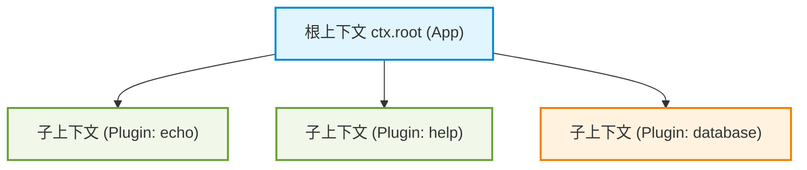
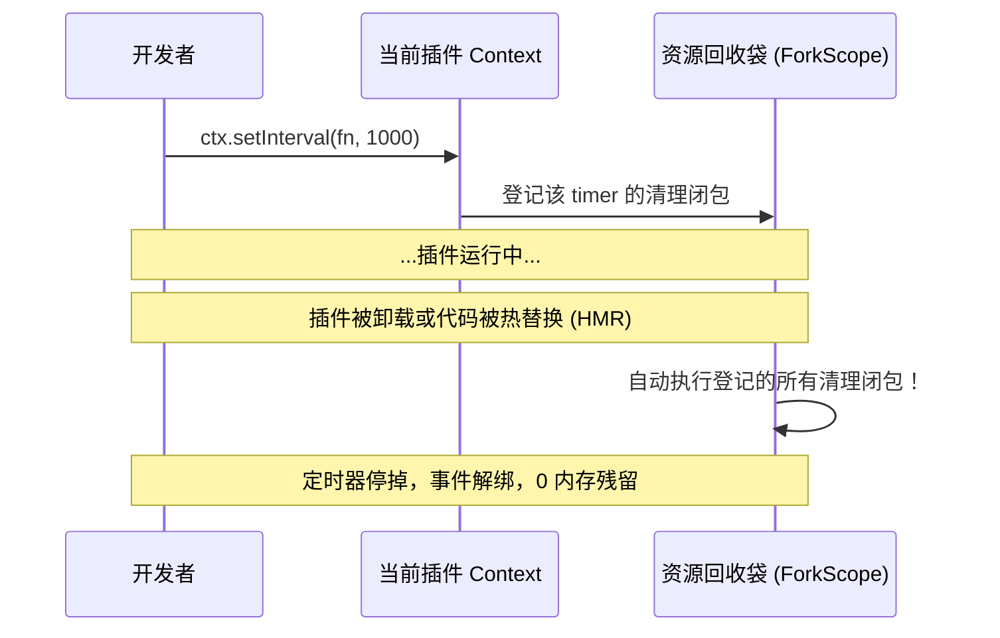
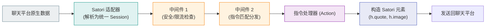

# Koishi 底层工作原理实战通识教程 (A Beginner's Guide to Koishi's Internals)

> **适用读者**：零基础或刚接触 Koishi 的开发者。如果你熟悉基本的 JavaScript/TypeScript 语法，但面对 Koishi 的 `Context`、`inject`、`Service`、`Session`、`Disposable` 感到抽象晦涩，本书将通过**由浅入深的通俗比喻**与**开箱即用的可执行代码实验（Mini-Labs）**，带你从底层彻底搞懂“它到底是如何运转的”。

---

## 目录 (Table of Contents)

1. [第一章：思维模型的转变 —— 为什么 Koishi 与传统 Bot 框架不同？](#第一章思维模型的转变--为什么-koishi-与传统-bot-框架不同)
2. [第二章：资源不泄漏的秘密 —— 深入理解 Disposable 与生命周期](#第二章资源不泄漏的秘密--深入理解-disposable-与生命周期)
3. [第三章：微内核容器 —— 亲手编写一个 IoC 服务 (Service)](#第三章微内核容器--亲手编写一个-ioc-服务-service)
4. [第四章：消息的奇幻漂流 —— Satori 消息流水线与中间件洋葱模型](#第四章消息的奇幻漂流--satori-消息流水线与中间件洋葱模型)
5. [第五章：指令系统的秘密 —— 字符串是如何变成强类型参数的？](#第五章指令系统的秘密--字符串是如何变成强类型参数的)
6. [第六章：无缝持久化 —— Minato ORM 的声明式数据模型](#第六章无缝持久化--minato-orm-的声明式数据模型)
7. [结语与进阶挑战路线](#结语与进阶挑战路线)

---

## 第一章：思维模型的转变 —— 为什么 Koishi 与传统 Bot 框架不同？

### 1.1 传统写法 vs Koishi 写法

传统的机器人开发库（如早期基于 WebSocket 或全局客户端的框架）通常是**面向全局单例**的：

```js
// ❌ 传统模式：高度耦合，难以热重载与模块解耦
const client = new SomeBotClient({ token: '...' })
client.on('message', (msg) => {
  if (msg.content === 'ping') msg.reply('pong')
})
client.login()
```

这种写法的致命缺陷在于：
- **无法安全热重载**：如果要修改 `ping` 的逻辑，必须杀掉整个 Node.js 进程重启；
- **平台绑定**：换一个通讯平台（如从 QQ 迁移到 Discord），事件对象结构全变，所有业务逻辑全部推倒重写；
- **全局状态污染**：多个插件之间互相修改全局变量，难以追踪 Bug。

### 1.2 Koishi 的世界观：一切皆 Context（上下文树）

在 Koishi 中，应用是一个**树状结构（Context Tree）**。根节点是 `App`，而每一个插件在加载时，都生活在派生出来的子枝干（`ForkScope`）中：



**核心法则**：
> **你写的任何业务逻辑（事件监听、命令注册、定时任务），绝不要绑定在全局，必须且只能绑定在你当前手里的这根 `ctx` 枝干上！**

---

### 🧪 Mini-Lab 1：自包含可执行实验 —— 体验 Context 的层级派生

打开终端，进入项目根目录，使用 Node 运行以下自包含可执行脚本：

```bash
node -e "
const { Context } = require('koishi');
const app = new Context();

console.log('1. 根节点创建成功');

// 注册插件 A
app.plugin((ctx) => {
  console.log('2. 插件 A 已加载，获取到专属子 Context');
  ctx.on('custom-event', () => console.log('   [插件 A] 收到自定义事件'));
});

// 注册插件 B
app.plugin((ctx) => {
  console.log('3. 插件 B 已加载，触发事件');
  ctx.emit('custom-event');
});

app.start().then(() => console.log('4. 应用启动完成'));
"
```

#### 预期终端输出：
```text
1. 根节点创建成功
2. 插件 A 已加载，获取到专属子 Context
3. 插件 B 已加载，触发事件
   [插件 A] 收到自定义事件
4. 应用启动完成
```

---

## 第二章：资源不泄漏的秘密 —— 深入理解 Disposable 与生命周期

### 2.1 什么是 Disposable？

在计算机科学中，**Disposable** 是指一个“用来擦屁股的函数”（即资源销毁闭包，签名通常是 `() => void`）。

平时我们在原生 Node.js 里写：
```js
const timer = setInterval(() => { ... }, 1000)
// 清理时必须手动记得：
clearInterval(timer)
```
如果你忘记了 `clearInterval`，哪怕模块被删了，定时器仍然在后台死循环运行，导致内存暴涨。

### 2.2 Koishi 如何实现“自动擦屁股”？

在 Koishi 中，`ctx.on()`、`ctx.setInterval()`、`ctx.middleware()` 都会返回一个销毁函数，并**自动把这个销毁函数记录在当前插件的回收袋（Scope）里**：



---

### 🧪 Mini-Lab 2：亲自验证自动卸载与生命周期

本实验将模拟“加载插件 -> 定时器工作 -> 动态卸载插件”的过程，你会亲眼看到定时器无需手动 `clearInterval` 就会立刻停下。

在终端运行以下代码：

```bash
node -e "
const { Context } = require('koishi');
const app = new Context();

// 定义一个具有生命周期追踪的插件
const myPlugin = (ctx) => {
  console.log('>>> [Plugin] 插件挂载成功');

  let count = 0;
  ctx.setInterval(() => {
    count++;
    console.log('>>> [Plugin] 心跳 tick #' + count);
  }, 500);

  ctx.on('dispose', () => {
    console.log('>>> [Plugin] 插件监听到 dispose 事件，正在清理自定义资源...');
  });
};

// 1. 挂载插件
const fork = app.plugin(myPlugin);

app.start().then(() => {
  // 2. 运行 1.6 秒（允许心跳打印约 3 次）
  setTimeout(() => {
    console.log('>>> [Main] 现在动态卸载该插件 (fork.dispose()) ...');
    fork.dispose();

    // 3. 卸载后再等待 1.5 秒，观察定时器是否彻底静默
    setTimeout(() => {
      console.log('>>> [Main] 验证完毕：卸载后心跳再无输出，进程安全退出。');
      process.exit(0);
    }, 1500);
  }, 1600);
});
"
```

#### 预期终端输出：
```text
>>> [Plugin] 插件挂载成功
>>> [Plugin] 心跳 tick #1
>>> [Plugin] 心跳 tick #2
>>> [Plugin] 心跳 tick #3
>>> [Main] 现在动态卸载该插件 (fork.dispose()) ...
>>> [Plugin] 插件监听到 dispose 事件，正在清理自定义资源...
>>> [Main] 验证完毕：卸载后心跳再无输出，进程安全退出。
```

> **原理启示**：只要你使用 `ctx.` 提供的 API，你写的代码天生就具备**热重载安全性**。

---

## 第三章：微内核容器 —— 亲手编写一个 IoC 服务 (Service)

### 3.1 什么是控制反转 (IoC) 与服务 (Service)？

- **传统做法（直接依赖）**：插件 A 想用数据库，插件 A 在自己的代码里 `import db from './db'`。一旦数据库配置变了，插件 A 跟着报错。
- **Koishi 做法（控制反转）**：
  1. 某个插件提供数据库能力，向底层容器声明：**“我是 `database` 服务”**；
  2. 插件 A 只需声明：**“我需要 `database` 服务 (`inject = ['database']`)”**；
  3. Koishi 会在依赖满足时，才激活插件 A，并将服务实例直接挂在 `ctx.database` 上。

### 3.2 继承 `Service` 基类

所有 Koishi 服务都继承自 `Service` 类。构造函数中的参数：
- `ctx`: 父上下文
- `name`: 服务名称（对应 `ctx[name]`）
- `immediate`: 是否在创建瞬间就处于就绪状态

---

### 🧪 Mini-Lab 3：手写一个跨插件共享的“代币银行服务”

这个实验演示如何编写一个全局服务，并由另一个完全独立的插件消费它。

在终端运行以下命令：

```bash
node -e "
const { Context, Service } = require('koishi');

// 1. 定义一个代币银行服务
class BankService extends Service {
  constructor(ctx) {
    // 注册服务名为 'bank'
    super(ctx, 'bank', true);
    this.accounts = new Map();
  }

  deposit(user, amount) {
    const current = this.accounts.get(user) || 0;
    this.accounts.set(user, current + amount);
    return this.accounts.get(user);
  }

  getBalance(user) {
    return this.accounts.get(user) || 0;
  }
}

const app = new Context();

// 2. 插件 Provider：提供服务
app.plugin((ctx) => {
  ctx.plugin(BankService);
  console.log('>>> [Provider] BankService 已注册到 ctx.bank');
});

// 3. 插件 Consumer：消费服务
const ConsumerPlugin = {
  name: 'consumer',
  inject: ['bank'], // 显式声明强依赖
  apply(ctx) {
    console.log('>>> [Consumer] 依赖满足，开始消费银行服务：');
    console.log('   向 Alice 存入 100 元，当前余额：' + ctx.bank.deposit('Alice', 100));
    console.log('   向 Alice 存入 50 元，当前余额：' + ctx.bank.deposit('Alice', 50));
    console.log('   查询 Alice 最终余额：' + ctx.bank.getBalance('Alice'));
  }
};

app.plugin(ConsumerPlugin);
app.start();
"
```

#### 预期终端输出：
```text
>>> [Provider] BankService 已注册到 ctx.bank
>>> [Consumer] 依赖满足，开始消费银行服务：
   向 Alice 存入 100 元，当前余额：100
   向 Alice 存入 50 元，当前余额：150
   查询 Alice 最终余额：150
```

---

## 第四章：消息的奇幻漂流 —— Satori 消息流水线与中间件洋葱模型

### 4.1 消息的生命周期

当外部聊天平台（如 QQ 群或 Discord 频道）有人发了一条消息：



### 4.2 洋葱模型核心规则
- 中间件形式为 `ctx.middleware(async (session, next) => { ... })`；
- 如果你调用 `return next()`，消息会**传递给下一个中间件**；
- 如果你**不调用** `next()`，直接 `return '回复内容'` 或结束函数，消息管道就会在此时**被拦截短路**！

---

### 🧪 Mini-Lab 4：使用 Mock 适配器在终端模拟真实聊天交互

Koishi 内置了 `mock` 适配器，无需配置任何第三方平台，就可以在终端里像真实聊天一样收发消息并观察洋葱中间件执行顺序。

在终端执行以下代码：

```bash
node -e "
const { Context } = require('koishi');
const mock = require('@koishijs/plugin-mock');

const app = new Context();
app.plugin(mock);

// 中间件 1：拦截器（过滤违禁词）
app.middleware(async (session, next) => {
  console.log('[中间件 1] 收到消息:', session.content);
  if (session.content.includes('spam')) {
    console.log('[中间件 1] 发现广告词 spam，直接拦截！');
    return '检测到违禁词，已拦截！';
  }
  // 放行给后续处理
  return next();
});

// 中间件 2：业务回复
app.middleware(async (session, next) => {
  console.log('[中间件 2] 进入业务层');
  if (session.content === 'hello') {
    return 'Hello, 我是可爱的 Koishi 机器人！';
  }
  return next();
});

app.start().then(async () => {
  const client = app.mock.client('user123');

  console.log('\n--- 测试场景 A：正常消息 ---');
  let reply = await client.receive('hello');
  console.log('机器人最终回复 ->', reply);

  console.log('\n--- 测试场景 B：触发中间件拦截 ---');
  reply = await client.receive('buy this spam item');
  console.log('机器人最终回复 ->', reply);

  process.exit(0);
});
"
```

#### 预期终端输出：
```text
--- 测试场景 A：正常消息 ---
[中间件 1] 收到消息: hello
[中间件 2] 进入业务层
机器人最终回复 -> Hello, 我是可爱的 Koishi 机器人！

--- 测试场景 B：触发中间件拦截 ---
[中间件 1] 收到消息: buy this spam item
[中间件 1] 发现广告词 spam，直接拦截！
机器人最终回复 -> 检测到违禁词，已拦截！
```

---

## 第五章：指令系统的秘密 —— 字符串是如何变成强类型参数的？

### 5.1 指令语法的解构

日常我们在群里发 `!echo -a 123`，Koishi 是如何处理的？

```text
ctx.command('calc <a:number> <b:number>', '加法计算器')
   .option('precision', '-p <digits:number> 结果保留小数位', { fallback: 2 })
   .action(({ options }, a, b) => { ... })
```

语法规则一目了然：
- `<arg>`：必选参数
- `[arg]`：可选参数
- `<arg:number>`：指定类型为数字（Koishi 会自动做类型转换，转失败会礼貌提醒用户输入合规类型）
- `.option('name', '-n <val>')`：短标志与长选项

---

### 🧪 Mini-Lab 5：编写一个带类型验证与选项的计算器指令

在终端运行以下代码：

```bash
node -e "
const { Context } = require('koishi');
const mock = require('@koishijs/plugin-mock');

const app = new Context();
app.plugin(mock);

// 注册计算器指令
app.command('calc <a:number> <b:number>', '简易加法计算器')
  .option('round', '-r 四舍五入取整')
  .action(({ options }, a, b) => {
    const sum = a + b;
    if (options.round) {
      return '计算结果（取整）：' + Math.round(sum);
    }
    return '计算结果：' + sum;
  });

app.start().then(async () => {
  const client = app.mock.client('user_tester');

  console.log('>>> 用户输入: calc 10.4 20.3');
  console.log('<<< 机器人回:', await client.receive('calc 10.4 20.3'));

  console.log('\n>>> 用户输入（带 -r 选项）: calc 10.4 20.3 -r');
  console.log('<<< 机器人回:', await client.receive('calc 10.4 20.3 -r'));

  console.log('\n>>> 用户输入非法参数: calc abc 20');
  console.log('<<< 机器人回:', await client.receive('calc abc 20'));

  process.exit(0);
});
"
```

#### 预期终端输出：
```text
>>> 用户输入: calc 10.4 20.3
<<< 机器人回: 计算结果：30.7

>>> 用户输入（带 -r 选项）: calc 10.4 20.3 -r
<<< 机器人回: 计算结果（取整）：31

>>> 用户输入非法参数: calc abc 20
<<< 机器人回: 输入的参数类型无效，期望为 number。
```

---

## 第六章：无缝持久化 —— Minato ORM 的声明式数据模型

### 6.1 为什么不要手写 SQL 字符串？
1. **防 SQL 注入**：手动拼接字符串极易被黑客输入恶意构造字符；
2. **多数据库兼容**：在开发机本地你可能只想用零配置的 `sqlite` 或纯内存模式，在生产服务器上你可能要用高并发的 `mysql` 或 `postgres`。手写 SQL 会让代码彻底与某一种特定数据库绑死。

### 6.2 Minato 的哲学
使用对象式声明：

```ts
ctx.model.extend('todo_list', {
  id: 'unsigned',
  title: 'string',
  completed: 'boolean',
}, {
  autoInc: true, // 自增主键
})
```

---

### 🧪 Mini-Lab 6：开箱即用的内存数据库待办事项系统 (CRUD 实战)

Minato 提供了纯内存数据库驱动 `@minatojs/driver-memory`，无需安装任何本地数据库引擎即可执行完整 CRUD。

在终端运行以下代码：

```bash
node -e "
const { Context } = require('koishi');
const memory = require('@minatojs/driver-memory');

const app = new Context();
// 启用内存数据库
app.plugin(memory);

// 1. 声明数据表模型
app.model.extend('todo', {
  id: 'unsigned',
  content: 'string',
  isDone: { type: 'boolean', initial: false },
}, {
  autoInc: true,
});

app.start().then(async () => {
  console.log('1. [Create] 插入两条待办事项...');
  const item1 = await app.database.create('todo', { content: '学习 Koishi 底层机制' });
  const item2 = await app.database.create('todo', { content: '给开源仓库提 PR' });
  console.log('   插入成功:', item1, item2);

  console.log('\n2. [Update] 标记第 1 条待办为已完成 (isDone: true)...');
  await app.database.set('todo', { id: item1.id }, { isDone: true });

  console.log('\n3. [Query] 查询所有未完成的待办事项...');
  const pending = await app.database.get('todo', { isDone: false });
  console.log('   查询结果:', pending);

  console.log('\n4. [Delete] 删除第 2 条待办事项...');
  await app.database.remove('todo', { id: item2.id });
  const remaining = await app.database.get('todo', {});
  console.log('   数据库剩余记录数:', remaining.length);

  process.exit(0);
});
"
```

#### 预期终端输出：
```text
1. [Create] 插入两条待办事项...
   插入成功: { id: 1, content: '学习 Koishi 底层机制', isDone: false } { id: 2, content: '给开源仓库提 PR', isDone: false }

2. [Update] 标记第 1 条待办为已完成 (isDone: true)...

3. [Query] 查询所有未完成的待办事项...
   查询结果: [ { id: 2, content: '给开源仓库提 PR', isDone: false } ]

4. [Delete] 删除第 2 条待办事项...
   数据库剩余记录数: 1
```

---

## 结语与进阶挑战路线 (Summary & Mastery Road)

恭喜你！通过上面 6 个可执行实验，你已经直观击破了 Koishi 最核心的底层支柱：
- [x] **第一章**：掌握了树状 Context 结构，理解了插件如何生活在各自的作用域枝干中；
- [x] **第二章**：理解了 Disposable 回收闭包，学会了编写 0 内存泄漏的安全插件；
- [x] **第三章**：学会了继承 `Service` 基类，掌握了控制反转与服务注入；
- [x] **第四章**：领悟了中间件洋葱管道与短路拦截；
- [x] **第五章**：搞懂了指令语法解析与强类型参数校验；
- [x] **第六章**：学会了使用 Minato ORM 进行跨数据库兼容的持久化建模。

### 🚀 课后动手挑战 (Homework)
尝试将 Mini-Lab 3 的 `BankService` 与 Mini-Lab 6 的 `app.model` 结合起来，编写一个支持在终端输入 `!pay <user> <amount>` 的全功能虚拟转账机器人插件！
