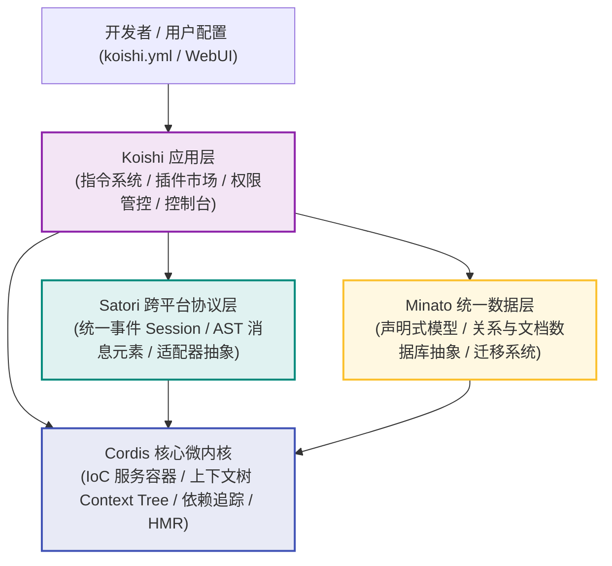
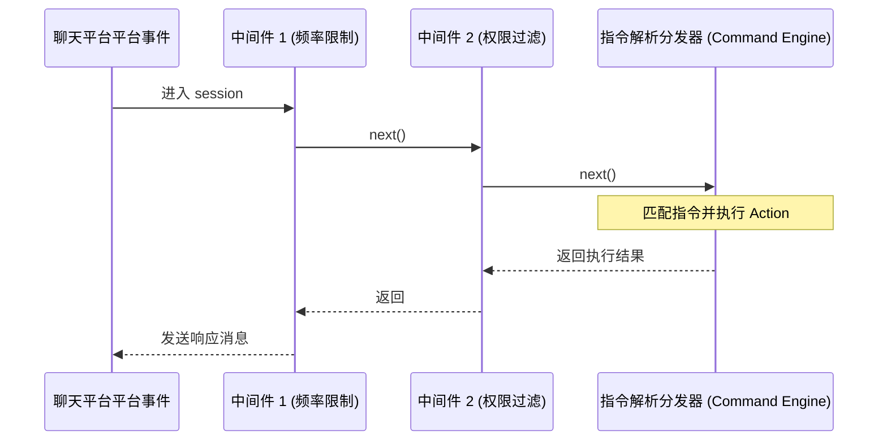

# Koishi 核心架构与实战精通手册 (Koishi Mastery Playbook)

本手册专为希望在最短时间内深入理解并精通 **Koishi** 及其底层内核体系的开发者编写。不同于泛泛的入门指引，本手册直击 Koishi 的**底层架构机制**，辅以**工业级实战食谱（Cook Recipes）**，剖析 Context 树、IoC 依赖注入、Satori 消息流水线、洋葱中间件模型与 Minato ORM 状态机，助你在几分钟内建立起系统化的核心认知。

---

## 1. 核心架构全景：分层解耦体系 (Architecture Overview)

Koishi 并非一个单体的聊天机器人框架，而是一个高度分层、各司其职的模块化微内核生态：



### 四大核心基石：
1. **Cordis (微内核层)**：纯粹的依赖注入（IoC）与服务生命周期容器，管理 Context 树型继承关系和所有副作用（Disposable）回收。
2. **Satori (通讯层)**：统一所有即时通讯平台（QQ、Telegram、Discord、飞书、微信等）的协议抽象，将异构消息解析为统一的 **AST 消息元素（Element）**。
3. **Minato (存储层)**：类型安全的多数据库抽象 ORM，一套代码无缝跑在 SQLite、MySQL、PostgreSQL 或 MongoDB 之上。
4. **Koishi (业务层)**：装配 CLI、插件热重载机制、多语言 i18n 系统、命令执行器与可视化 Web 控制台。

---

## 2. 掌握 Koishi 必须理解的五大底层机制 (Deep Dive: 5 Core Mechanisms)

### 机制 1：Context 树与自动资源回收 (The Context Tree & Disposable Lifecycle)
在常规 Node.js 应用中，注册全局事件监听器、定时器极易造成**内存泄漏**。Koishi 的解法是：**一切副作用必须绑定在 Context 实例上**。

- 每一个插件加载时，Cordis 会为其派生出一个专属的 `ForkScope`（子 Context）。
- 当调用 `ctx.on()`、`ctx.setInterval()`、`ctx.middleware()` 时，该行为产生的回收函数（`dispose`）会被登记在当前 Scope 的资源跟踪列表上。
- **当插件被停用或重载时，该 Scope 下的所有事件监听、定时器、注册的命令将被自动全部销毁并垃圾回收，做到 0 内存残留**。

### 机制 2：IoC 服务注入与 TypeScript 模块扩充 (Module Augmentation)
Koishi 采用声明式依赖注入。服务通过原型链挂载在 `Context` 上，并通过 TypeScript 的 `declare module` 达成编译期 100% 强类型提示：

```ts
// 声明阶段：为 Context 添加强类型属性提示
declare module 'koishi' {
  interface Context {
    myService: MyService
  }
}

// 消费阶段：显式声明强依赖，未就绪前插件绝不提前执行
export const inject = ['database', 'http', 'myService']
```

### 机制 3：Satori 消息 AST 元素流水线 (AST Element Pipeline)
Koishi 拒绝传统的字符串拼接与乱序正则。任何平台（纯文本、Markdown、富文本、卡片、图文混排）接收与发送的消息，均被结构化为 **Satori 元素节点树**（类似 JSX/HTML DOM）：

```text
[QQ/Discord 原生数据] ──> Satori Adapter ──> AST 结构化元素: <message><quote id="..."/>Hello <at id="123"/> <image url="..."/></message>
```
开发者使用 `h(type, attrs, ...children)` 创建或解构消息元素，具备极致跨平台兼容性。

### 机制 4：中间件洋葱模型与指令分发 (Onion Middleware & Commands)
Koishi 的事件驱动管线采用与 Koa 相似的 **洋葱模型（Onion Model）**：



- 若任意中间件不调用 `next()`，事件管道即被熔断（短路），避免后续中间件与指令被无谓执行。
- 指令系统实际上是注册在全局中间件链末端的最高优先级模式匹配器。

### 机制 5：声明式模式检验 (Schemastery) 与 WebUI 自动映射
在 Koishi 中，插件配置项不是通过写说明书交给用户的，而是用 **`@cordisjs/schema` (Schemastery)** 声明：
- Schema 兼具 **运行时校验**、**默认值回退**、**类型推导** 和 **WebUI 自动表单渲染** 四大能力。
- 你编写的每一个 Schema 属性，都会在 Koishi 的网页控制台中直接生成对应的开关、输入框、下拉单选或嵌套表格。

---

## 3. 实战烹饪食谱 (5 Concrete Cook Recipes)

以下食谱展示了 Koishi 底层机制在日常开发中的真实应用。

---

### Recipe 1：零内存泄漏的生命周期与定时任务 (Context Lifecycle & Disposables)

> **目标**：演示 Context 如何接管事件、Interval 与清理逻辑，杜绝内存泄漏。

```ts
import { Context, Schema } from 'koishi'

export const name = 'lifecycle-demo'

export interface Config {
  interval: number
}

export const Config: Schema<Config> = Schema.object({
  interval: Schema.natural().default(60).description('轮询间隔（秒）'),
})

export function apply(ctx: Context, config: Config) {
  // 1. 生命周期事件：当应用与全部服务就绪后触发
  ctx.on('ready', async () => {
    ctx.logger.info('所有依赖服务已就绪，开始初始化后台任务...')
  })

  // 2. 绑在 ctx 上的定时器：在插件热重载或禁用时，引擎自动 clearInterval，无需手动编写清理函数
  ctx.setInterval(() => {
    ctx.logger.debug('执行健康检查心跳...')
  }, config.interval * 1000)

  // 3. 注册带自动注销的会话监听
  ctx.on('message', (session) => {
    if (session.content === 'ping') {
      session.send('pong')
    }
  })

  // 4. 自定义资源清理（如关闭外部 TCP/gRPC 连接）
  ctx.on('dispose', () => {
    ctx.logger.info('插件正在卸载，释放底层自定义连接池...')
  })
}
```

---

### Recipe 2：声明并注入一个自定义强类型微服务 (Custom Service & IoC)

> **目标**：创建一个跨插件共享的 `TokenBucket` 限流服务，并向 TypeScript 类型系统注册。

```ts
import { Context, Service, Schema } from 'koishi'

// 1. 扩充 Context 接口，提供类型安全访问
declare module 'koishi' {
  interface Context {
    rateLimiter: RateLimiterService
  }
}

// 2. 继承 Service 基类（传入服务名 'rateLimiter'）
export class RateLimiterService extends Service {
  private buckets = new Map<string, number>()

  constructor(ctx: Context) {
    // 调用 super 自动挂载到 ctx.rateLimiter，并在生命周期内安全托管
    super(ctx, 'rateLimiter', true)
  }

  public takeToken(userId: string, cost = 1): boolean {
    const current = this.buckets.get(userId) ?? 10
    if (current >= cost) {
      this.buckets.set(userId, current - cost)
      return true
    }
    return false
  }
}

// 3. 插件 A：提供服务
export function applyRateLimiterPlugin(ctx: Context) {
  ctx.plugin(RateLimiterService)
}

// 4. 插件 B：消费服务（通过 inject 确保服务就绪后才加载）
export const ConsumerPlugin = {
  name: 'rate-consumer',
  inject: ['rateLimiter'], // 强依赖声明
  apply(ctx: Context) {
    ctx.middleware((session, next) => {
      // 拥有完整的类型推导！
      if (!ctx.rateLimiter.takeToken(session.userId)) {
        return session.send('请求过于频繁，请稍后再试。')
      }
      return next()
    })
  }
}
```

---

### Recipe 3：Satori 结构化元素处理与图文混排 (AST Element & Pipeline)

> **目标**：解析并构造结构化消息，处理 `@提及`、引用回复和动态图片生成。

```ts
import { Context, h } from 'koishi'

export const name = 'message-ast-demo'

export function apply(ctx: Context) {
  ctx.command('rank', '查看今日群排行榜')
    .action(async ({ session }) => {
      if (!session) return

      // 使用 h 辅助函数构建跨平台 AST 节点树
      const message = h('message', [
        // 1. 引用触发者的原消息
        h('quote', { id: session.messageId }),
        // 2. @ 触发用户
        h('at', { id: session.userId, name: session.username }),
        ' 这是今日排行榜结果：\n',
        // 3. 结构化文本
        'No.1: Alice (100 pts)\nNo.2: Bob (85 pts)\n',
        // 4. 异步图像节点（支持 Base64 / URL / Buffer）
        h.image('https://koishi.chat/logo.png')
      ])

      // 发送元素树
      await session.send(message)
    })

  // 接收并解构消息 AST
  ctx.middleware(async (session, next) => {
    // 利用 Satori 的 h.select 查询元素
    const atElements = h.select(session.elements, 'at')
    const hasBotAt = atElements.some(el => el.attrs.id === session.bot.selfId)

    if (hasBotAt) {
      session.send('你正在召唤我吗？发送 !help 查看帮助！')
      return // 拦截，不再往后流转
    }

    return next()
  })
}
```

---

### Recipe 4：声明式参数校验与高阶指令注册 (Command, Authority & Schema)

> **目标**：实现一个具备用户权限鉴别、可选布尔选项、数字范围校验和 Web 控制台配置项的管理指令。

```ts
import { Context, Schema } from 'koishi'

export const name = 'admin-guard'

export interface Config {
  defaultPunishTime: number
  notifyBroadcast: boolean
}

// 自动映射到 Web 控制台的配置表单定义
export const Config: Schema<Config> = Schema.object({
  defaultPunishTime: Schema.natural().default(300).description('默认禁言时长（秒）'),
  notifyBroadcast: Schema.boolean().default(true).description('是否广播执行通知'),
})

export function apply(ctx: Context, config: Config) {
  ctx.command('mute <user:user> [duration:number]', '群成员禁言管理', { authority: 3 })
    .option('reason', '-r <text:string> 指定禁言理由')
    .option('silent', '-s 静默执行')
    .userFields(['authority', 'name']) // 自动注入用户表字段
    .action(async ({ session, options }, user, duration) => {
      if (!session) return

      // 参数类型转换与回退
      const time = duration ?? config.defaultPunishTime
      const targetUserId = user.split(':')[1] // user 解析为 "platform:id"

      try {
        await session.bot.muteGuildMember(session.guildId, targetUserId, time * 1000)
        
        if (!options.silent) {
          const reasonNotice = options.reason ? `，理由：${options.reason}` : ''
          return `已成功禁言用户 ${targetUserId} 共 ${time} 秒${reasonNotice}。`
        }
      } catch (err) {
        ctx.logger.error('禁言失败:', err)
        return `操作执行失败：${err.message}`
      }
    })
}
```

---

### Recipe 5：Minato ORM 声明式数据建模与原子运算 (Minato Database Extension)

> **目标**：声明一个全新的用户经济系统数据表，演示原子累加运算（防并发脏读）与多数据库无缝适配。

```ts
import { Context, Schema } from 'koishi'

// 1. 扩展数据库模型类型定义
declare module 'koishi' {
  interface Tables {
    economy_user: EconomyUser
  }
}

export interface EconomyUser {
  id: number
  userId: string
  balance: number
  updatedAt: Date
}

export const name = 'economy-system'
export const inject = ['database'] // 强声明依赖数据库服务

export function apply(ctx: Context) {
  // 2. 声明式定义表结构（Minato 自动在 SQLite/MySQL 中迁移创建）
  ctx.model.extend('economy_user', {
    id: 'unsigned',
    userId: 'string',
    balance: { type: 'unsigned', initial: 0 },
    updatedAt: 'timestamp',
  }, {
    autoInc: true,
    unique: ['userId'], // 用户唯一索引
  })

  // 3. 注册转账指令，演示数据库原子运算
  ctx.command('pay <target:user> <amount:posint>', '向指定用户转账')
    .action(async ({ session }, target, amount) => {
      if (!session) return
      const targetUserId = target.split(':')[1]

      if (targetUserId === session.userId) {
        return '不能转账给自己！'
      }

      // 查询当前付款人余额
      const [sender] = await ctx.database.get('economy_user', { userId: session.userId })
      if (!sender || sender.balance < amount) {
        return `转账失败：您的余额不足（当前：${sender?.balance ?? 0}）`
      }

      // 原子操作：避免并发 Race Condition 导致的金钱复制
      await ctx.database.set('economy_user', { userId: session.userId }, (row) => ({
        balance: { $subtract: [row.balance, amount] },
        updatedAt: new Date(),
      }))

      // 为收款人原子增发
      await ctx.database.upsert('economy_user', [{
        userId: targetUserId,
        balance: amount,
        updatedAt: new Date(),
      }], (row) => ({
        balance: { $add: [row.balance, amount] },
        updatedAt: new Date(),
      }))

      return `成功向 ${targetUserId} 转账 ${amount} 个代币！`
    })
}
```

---

## 4. 生产级反模式与避坑清单 (Anti-Patterns & Best Practices)

| 禁忌反模式 (Anti-Pattern) | 危害 (Consequence) | 正确姿势 (Best Practice) |
| :--- | :--- | :--- |
| **直接使用全局 `setInterval`** | 插件重载时原定时器依然在后台运行，引起内存泄漏与重复执行 | 必须使用 `ctx.setInterval()`，生命周期由 Context 树安全管理 |
| **使用字符串拼接 HTML/UBB 发送图片** | 跨平台适配失效，在 Telegram/Discord 上直接暴露乱码标签 | 始终使用结构化 `h.image(url)` 或 `h('image', { src })` 节点 |
| **在模块顶层直接调用服务方法** | 顶层代码执行时，其他插件尚未就绪，引发 `Cannot read undefined` 崩溃 | 使用 `export const inject = ['...']`，并将业务代码放在 `apply()` 或 `ctx.on('ready')` 内 |
| **数据库并发场景先查询再赋值** | `let newBal = oldBal + 10; db.set({ bal: newBal })` 引发脏写 | 使用 Minato 表达式操作符：`{ balance: { $add: [row.balance, 10] } }` |
| **指令 action 未做异步异常捕获** | 底层适配器 API 报错直接打崩全局事件循环 | 使用 `try/catch` 优雅处理并将用户可读的错误消息返回给 session |

---

## 5. 核心 API 速查手册 (Cheat Sheet)

```ts
// 上下文过滤选择器 (Context Selectors)
ctx.user('123456')               // 仅对特定用户生效的子上下文
ctx.guild('group_789')           // 仅对特定群组生效的子上下文
ctx.platform('discord')          // 仅在 Discord 平台生效
ctx.private()                    // 仅私聊环境生效

// 消息元素生成 (Satori Element)
h.text('文本内容')
h.at('用户ID')
h.image('https://example.com/a.png')
h.audio('path/to/audio.mp3')
h.quote('message_id')            // 引用回复

// 数据库常规查询 (Minato Database)
await ctx.database.get('table', { id: 1 })
await ctx.database.create('table', { name: 'Koishi' })
await ctx.database.set('table', { id: 1 }, { name: 'New Name' })
await ctx.database.remove('table', { id: 1 })
await ctx.database.upsert('table', [{ id: 1, name: 'Upserted' }])
```
