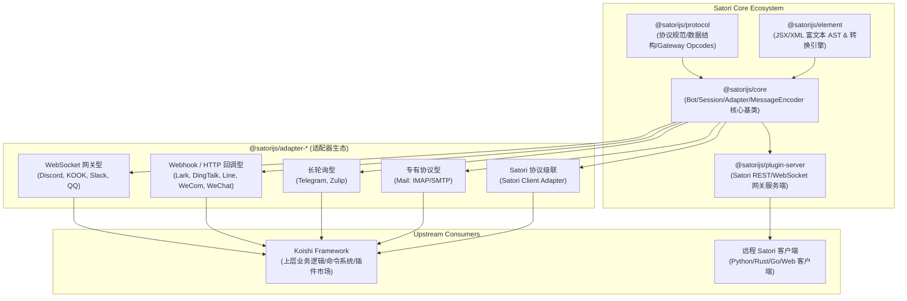
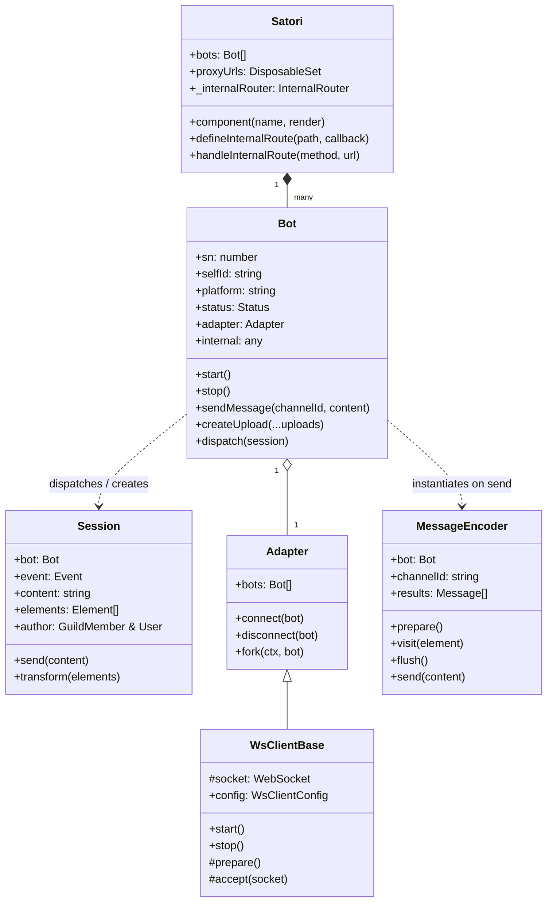
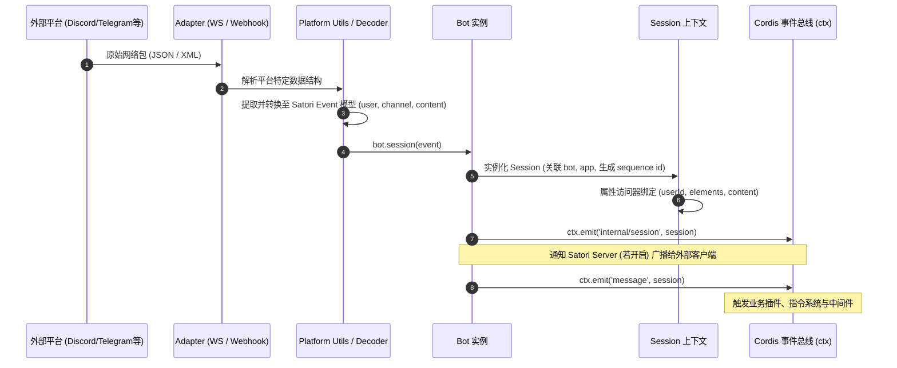
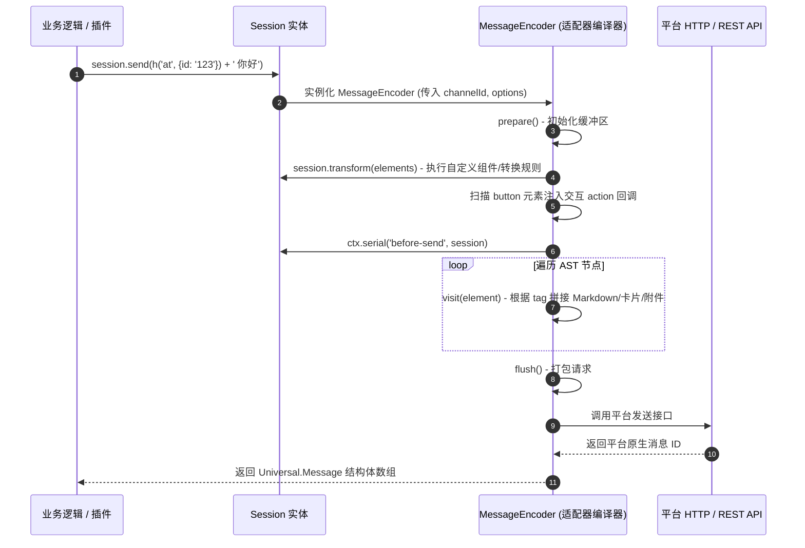
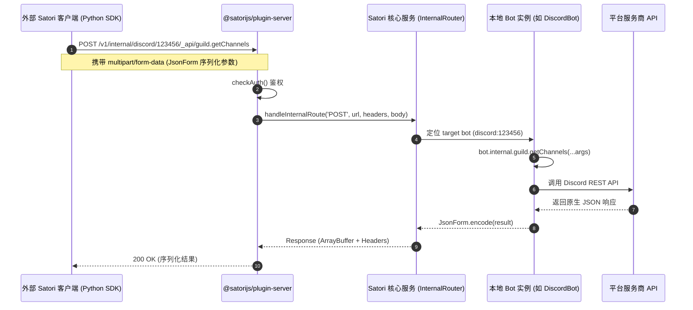

# Satori 子模块架构与代码全景图谱（Codemap）

> **子模块路径**：[`external/satori`](file:///d/koishi/external/satori)  
> **定位**：跨平台聊天机器人统一协议标准（Universal Messenger Protocol）与适配层框架  
> **核心机制**：标准协议抽象层 + 富文本 AST 渲染引擎 + Cordis 依赖注入容器 + 多协议网关服务端 + 15+ 异构平台适配器

---

## 1. 架构总览与生态定位

Satori 在 Koishi / Cordis 生态中扮演着**统一多平台消息协议底座**的角色。它将极其碎片化、异构的即时通讯平台（如 Discord, Telegram, QQ, 飞书, 钉钉, 企业微信, 微信公众号, 邮件等）抽象为标准化的消息模型、生命周期事件和通用 API 调用。



---

## 2. 仓库目录拓扑与工作区结构

Satori 采用 Yarn Workspaces + Yakumo 进行 Monorepo 多包管理，代码结构分为**核心基础包（`packages/*`）**与**平台适配器（`adapters/*`）**两大区域：

```
external/satori/
├── package.json              # 根工作区配置与 Yakumo 构建/测试脚本
├── yakumo.yml                # Yakumo 构建管线配置 (tsc + esbuild)
├── tsconfig.base.json        # 基础 TypeScript 编译配置
├── packages/                 # 核心模块
│   ├── protocol/             # @satorijs/protocol：数据契约、API 字典与网关规范
│   ├── element/              # @satorijs/element：富文本 AST、JSX 运行时与选择器
│   ├── core/                 # @satorijs/core：Bot、Session、Adapter、内部路由
│   ├── server/               # @satorijs/plugin-server：Koa/WS 统一协议服务端
│   └── create/               # create-satori：Satori 项目脚手架 CLI
└── adapters/                 # 平台适配器矩阵 (15个官方适配器)
    ├── dingtalk/             # 钉钉 (Webhook/Card/Internal API)
    ├── discord/              # Discord (Gateway WebSocket + REST API)
    ├── kook/                 # 开黑啦 (WebSocket Gateway)
    ├── lark/                 # 飞书/Lark (Webhook/Event Dispatcher)
    ├── line/                 # LINE (Webhook Callback)
    ├── mail/                 # 邮件 (IMAP 收信 + SMTP 发信)
    ├── matrix/               # Matrix (Matrix Client-Server API)
    ├── qq/                   # QQ (QQ 开放平台 Guild/Group WebSocket)
    ├── satori/               # Satori (连接远程 Satori 协议服务端的级联客户端)
    ├── slack/                # Slack (Socket Mode / Web API)
    ├── telegram/             # Telegram (Webhook / Long Polling)
    ├── wechat-official/      # 微信公众平台 (XML Webhook + Token Refresh)
    ├── wecom/                # 企业微信 (加密 Webhook + Media API)
    ├── whatsapp/             # WhatsApp (Cloud API / Webhook)
    └── zulip/                # Zulip (Long Polling Queue)
```

---

## 3. 核心包深入剖析（Core Packages Deep Dive）

### 3.1 [`@satorijs/protocol`](file:///d/koishi/external/satori/packages/protocol/src/index.ts) — 通用数据契约与协议规范

作为整个框架的数据定义层，定义了与任何即时通讯平台交互的标准数据模型和 REST/WS 规范。

* **API 方法映射字典 (`Methods`)**：
  将 RESTful 请求动作（如 `channel.get`, `message.create`, `guild.member.kick`）映射为强类型方法名（`getChannel`, `createMessage`, `kickGuildMember`）及其字段签名列表。
* **Universal 核心实体接口**：
  * [`User`](file:///d/koishi/external/satori/packages/protocol/src/index.ts#L211)：用户基础属性（`id`, `name`, `nick`, `avatar`, `isBot`）。
  * [`Channel`](file:///d/koishi/external/satori/packages/protocol/src/index.ts#L173)：频道/会话模型（`TEXT=0`, `DIRECT=1`, `CATEGORY=2`, `VOICE=3`）。
  * [`Guild`](file:///d/koishi/external/satori/packages/protocol/src/index.ts#L190) & [`GuildMember`](file:///d/koishi/external/satori/packages/protocol/src/index.ts#L296)：群组与群成员详情（权限、角色、入群时间等）。
  * [`Message`](file:///d/koishi/external/satori/packages/protocol/src/index.ts#L326)：包含富文本 elements 数组、文本 content、引用 quote、发送者及频道信息。
  * [`Login`](file:///d/koishi/external/satori/packages/protocol/src/index.ts#L306) & [`Status`](file:///d/koishi/external/satori/packages/protocol/src/index.ts#L318)：机器人登录态（`OFFLINE=0`, `ONLINE=1`, `CONNECT=2`, `DISCONNECT=3`, `RECONNECT=4`）。
* **网关协议规范 (`Opcode`)**：
  定义了 Satori Gateway WebSocket 的标准信令：
  * `Opcode.EVENT (0)`：服务端向客户端推送事件。
  * `Opcode.PING (1)` / `Opcode.PONG (2)`：双向心跳检测。
  * `Opcode.IDENTIFY (3)`：客户端鉴权与序号恢复（携带 `token` 与 `sn`）。
  * `Opcode.READY (4)`：鉴权成功，推送当前全量 logins 和 proxyUrls。
  * `Opcode.META (5)`：运行时元数据更新（如代理地址列表变更）。
* **资源编解码器 (`Resource`)**：
  提供 `encode` 与 `decode` 函数，支持将结构化实体（`quote`, `user`, `member`, `channel`, `guild`）与 XML-like Element 之间进行无损双向转换。

---

### 3.2 [`@satorijs/element`](file:///d/koishi/external/satori/packages/element/src/index.ts) — 富文本 AST 与模板引擎

Satori 的核心创新之一是基于 XML-like AST（抽象语法树）实现跨平台消息富文本表示。开发者可以用统一的 JSX 或 XML 标签（`<at id="123"/>`, ``）编写消息，并由适配器编译器渲染到各个具体平台。

* **AST 节点定义**：
  每个 Element 拥有唯一 Symbol 标识 `Symbol.for('satori.element')`，结构为：
  ```typescript
  interface Element {
    type: string            // 元素类型：如 'text', 'at', 'img', 'quote', 'sharp'
    attrs: Dict             // 属性字典：如 { id: '123', src: 'https://...' }
    children: Element[]     // 子元素节点列表
    toString(strip?: boolean): string // 序列化为 XML 字符串
  }
  ```
* **JSX 与工厂方法**：
  * 导出 `h`（即 `Element` 构造器），支持 JSX 转换（`h.jsx`, `h.jsxs`）。
  * 预置工厂：[`h.text()`](file:///d/koishi/external/satori/packages/element/src/index.ts#L543), [`h.at()`](file:///d/koishi/external/satori/packages/element/src/index.ts#L544), [`h.sharp()`](file:///d/koishi/external/satori/packages/element/src/index.ts#L545), [`h.quote()`](file:///d/koishi/external/satori/packages/element/src/index.ts#L546), [`h.image()`](file:///d/koishi/external/satori/packages/element/src/index.ts#L548), [`h.audio()`](file:///d/koishi/external/satori/packages/element/src/index.ts#L551), [`h.video()`](file:///d/koishi/external/satori/packages/element/src/index.ts#L550), [`h.file()`](file:///d/koishi/external/satori/packages/element/src/index.ts#L552)。
* **CSS 选择器引擎 (`h.select`)**：
  支持类似 DOM 的选择器查询语法，支持层级组合子：
  * 后代选择器：`"message at"`
  * 直接子代选择器：`"quote > at"`
  * 紧邻兄弟选择器：`"img + text"`
  * 一般兄弟选择器：`"img ~ text"`
* **模板解析与指令系统 (`h.parse`)**：
  内置高性能词法/语法解析器，支持插值 `{expr}` 与条件/循环指令（`{#if cond}...{:else}...{/if}`, `{#each list as item}...{/each}`）。
* **同步/异步访问者转换器 (`h.transform` / `h.transformAsync`)**：
  基于访问者模式（Visitor Pattern）递归遍历 AST 树，支持插件或适配器在发送前动态拦截、重写或替换元素节点。

---

### 3.3 [`@satorijs/core`](file:///d/koishi/external/satori/packages/core/src/index.ts) — 运行内核与生命周期

内核基于 [Cordis](https://github.com/shigma/cordis) 微内核设计，提供 Bot 管理、会话路由、适配器抽象与消息编译器。



#### 核心模块职责细分：

1. **[`Satori`](file:///d/koishi/external/satori/packages/core/src/index.ts#L162) (Cordis Service)**：
   * 注册为 `ctx.satori`，向上下文中注入 `ctx.bots`（通过 Proxy 实现数组与字典 `platform:selfId` 的双向访问）。
   * 管理多源代理地址白名单（`proxyUrls`）。
   * 注册全局内部路由 `internal:` 协议处理器，拦截并转发媒体或自定义 RPC 请求。
   * 提供组件注册接口（`ctx.component`）。

2. **[`Bot`](file:///d/koishi/external/satori/packages/core/src/bot.ts#L24) (抽象机器人基类)**：
   * **状态机管理**：维护 `OFFLINE`, `ONLINE`, `CONNECT`, `DISCONNECT`, `RECONNECT`，状态变更时自动触发 `login-updated` / `bot-status-updated`。
   * **事件分发中心 (`bot.dispatch`)**：标准化包装事件，触发 Cordis 事件总线（如 `message`, `guild-added`, `interaction/button`）。
   * **通用方法与异步迭代器**：基于协议规范实现了 `getMessageIter`, `getGuildMemberIter`, `getChannelIter` 等自动化分页拉取机制。
   * **临时文件存储与上传 (`createUpload`)**：为媒体文件生成带有生命周期的 `internal:` 内部临时 URL。

3. **[`Session`](file:///d/koishi/external/satori/packages/core/src/session.ts#L31) (会话上下文实体)**：
   * 封装单次事件上下文，提供快捷 getter/setter（`userId`, `channelId`, `guildId`, `author`, `isDirect` 等）。
   * 双向同步 `elements` 与 `content`（修改 `content` 字符串自动重解析为 `elements`，修改 `elements` 自动重新渲染 `content`）。
   * 支持通过 `setInternal(type, data)` 携带平台专有原生事件数据。

4. **[`Adapter`](file:///d/koishi/external/satori/packages/core/src/adapter.ts#L6) & [`WsClientBase`](file:///d/koishi/external/satori/packages/core/src/adapter.ts#L37)**：
   * `Adapter`：生命周期挂载与 Bot 实例关联。
   * `WsClientBase`：封装健壮的 WebSocket 客户端重连逻辑，提供初次连接与断线恢复的退避重试机制（`retryTimes`, `retryInterval`, `retryLazy`）。

5. **[`MessageEncoder`](file:///d/koishi/external/satori/packages/core/src/message.ts#L12) (消息编译器抽象基类)**：
   * 采用访问者模式解析 AST：
     * `prepare()`：初始化平台消息缓冲区与上传前置依赖。
     * `visit(element)`：递归访问各元素，转换为平台 Payload（如 Markdown 片段、Embed 卡片、附件等）。
     * `flush()`：将缓冲区中的消息打包为 HTTP/WS 请求实际发出，将生成的 `Message` 存入 `results`。
   * 自动拦截非链接型 `<button>` 元素，生成唯一回调 ID 并挂载至 `bot.callbacks`。

6. **[`InternalRouter`](file:///d/koishi/external/satori/packages/core/src/internal.ts#L69) & [`JsonForm`](file:///d/koishi/external/satori/packages/core/src/internal.ts#L109)**：
   * 基于 `path-to-regexp` 的内部路由分发器，用于在 Satori 实例间或插件间透传特殊请求。
   * `JsonForm` 支持将多层嵌套的复杂 JSON 与二进制文件打包进同一个 `multipart/form-data` 或 `application/json` 请求中，用于远程内部 API RPC 调用。

---

### 3.4 [`@satorijs/plugin-server`](file:///d/koishi/external/satori/packages/server/src/index.ts) — Satori 统一协议网关服务

该插件将当前的 Satori / Koishi 实例转变为一个符合 Satori 协议规范的标准**服务端（Gateway Server）**，允许其他语言编写的 Satori Client（Python, Go, Rust 等）直接接入。

* **RESTful API 端点 (`/v1/:name`)**：
  * 解析 HTTP POST 请求，通过头部 `Satori-User-ID` / `Satori-Platform` 路由到目标 Bot 实例。
  * 特殊处理 `createUpload` 多文件上传，将文件存入本地临时 Buffer 并生成 `internal:` URL。
  * 将 snake_case 请求参数转换为 camelCase 传给 Bot 方法，再将返回结果转换回 snake_case。
* **WebSocket 事件广播 (`/v1/events`)**：
  * 处理 `Opcode.IDENTIFY` 鉴权与 `sn` 序列号重连。
  * 支持事件会话重放缓存（`resumeTimeout` 内的离线事件重放）。
  * 监听 `internal/session` 事件，广播 `Opcode.EVENT`。
* **反向代理与内部隧道 (`/v1/proxy/*` & `/v1/internal/*`)**：
  * `/v1/proxy/:url`：校验白名单并为客户端转发受保护的媒体资源。
  * `/v1/internal/:path`：将外部调用穿透至 Bot 的内部 API（`bot.internal.*`）。
* **Webhook 推送支持**：
  * 支持动态注册与删除 Webhook（`/v1/meta/webhook.create`, `/v1/meta/webhook.delete`），将事件推送至外部 HTTP 回调地址。

---

## 4. 适配器生态矩阵（Adapters Matrix）

Satori 内置了 15 个平台的官方适配器，覆盖主流即时通讯场景。各适配器依据网络拓扑和协议特点划分为不同实现模式：

| 适配器目录 | 对应包名 | 连接模式 (Ingestion) | 核心特性与适配技术 |
| :--- | :--- | :--- | :--- |
| [`adapters/discord`](file:///d/koishi/external/satori/adapters/discord) | `@satorijs/adapter-discord` | Gateway WebSocket + REST | 支持完整 Discord Components（按钮/下拉）、Slash Commands、Embeds、Markdown 转换 |
| [`adapters/telegram`](file:///d/koishi/external/satori/adapters/telegram) | `@satorijs/adapter-telegram` | Webhook / Long Polling | 支持 HTML/MarkdownV2 富文本转换、Inline Keyboard 按钮、媒体组（MediaGroup）发送 |
| [`adapters/kook`](file:///d/koishi/external/satori/adapters/kook) | `@satorijs/adapter-kook` | WebSocket Gateway | CardMessage 卡片消息构建、KMarkdown 解析、资产上传流 |
| [`adapters/qq`](file:///d/koishi/external/satori/adapters/qq) | `@satorijs/adapter-qq` | WebSocket (官方网关) | 支持 QQ 官方机器人（频道 Guild 与群聊 Group/C2C）、Markdown 模板消息与按钮回调 |
| [`adapters/lark`](file:///d/koishi/external/satori/adapters/lark) | `@satorijs/adapter-lark` | Webhook HTTP | 飞书富文本 Post 消息、Interactive Card 卡片、动态生成 internal API 类型脚本 |
| [`adapters/dingtalk`](file:///d/koishi/external/satori/adapters/dingtalk) | `@satorijs/adapter-dingtalk` | Webhook HTTP | 钉钉互动卡片（Interactive Card）、企业内部应用与机器人集成 |
| [`adapters/wecom`](file:///d/koishi/external/satori/adapters/wecom) | `@satorijs/adapter-wecom` | 加密 Webhook HTTP | 企业微信消息加解密、图文消息、Media ID 上传换取 |
| [`adapters/wechat-official`](file:///d/koishi/external/satori/adapters/wechat-official) | `@satorijs/adapter-wechat-official`| XML Webhook HTTP | 微信公众号被动回复与客服接口、XML 解析与 Token 刷新 |
| [`adapters/line`](file:///d/koishi/external/satori/adapters/line) | `@satorijs/adapter-line` | Webhook HTTP | LINE Flex Message 弹性卡片、Quick Reply 快捷回复 |
| [`adapters/slack`](file:///d/koishi/external/satori/adapters/slack) | `@satorijs/adapter-slack` | Socket Mode / Web API | Block Kit 结构化块渲染、mrkdwn 转换 |
| [`adapters/matrix`](file:///d/koishi/external/satori/adapters/matrix) | `@satorijs/adapter-matrix` | Matrix Client-Server API | 端到端与房间同步事件、HTML 格式化与 m.room 消息映射 |
| [`adapters/whatsapp`](file:///d/koishi/external/satori/adapters/whatsapp) | `@satorijs/adapter-whatsapp` | Cloud API Webhook | WhatsApp 交互式按钮与模板消息映射 |
| [`adapters/zulip`](file:///d/koishi/external/satori/adapters/zulip) | `@satorijs/adapter-zulip` | Long Polling Queue | 消息流（Streams）与主题（Topics）映射 |
| [`adapters/mail`](file:///d/koishi/external/satori/adapters/mail) | `@satorijs/adapter-mail` | IMAP (收) + SMTP (发) | HTML 邮件排版、RFC2822 邮件头引用、附件流处理 |
| [`adapters/satori`](file:///d/koishi/external/satori/adapters/satori) | `@satorijs/adapter-satori` | Satori WS + HTTP | **Satori 协议客户端实现**：连接远程 Satori Server，代理 internal 动态 RPC 调用 |

---

## 5. 关键运行时流程与数据流图（Runtime Workflows）

### 5.1 入站消息事件流（Inbound Event Pipeline）

当外部聊天平台产生事件时，数据从网络层流向业务层的生命周期：



---

### 5.2 出站消息发送流（Outbound Message Pipeline）

开发者调用 `session.send()` 或 `bot.sendMessage()` 时的编译与发送过程：



---

### 5.3 Satori Server 级联与远程 RPC 穿透（Gateway & Internal Tunneling）

远程客户端（如 Python SDK）通过 Satori Server 调用底层平台独有 API 的过程：



---

## 6. 核心元编程与设计模式总结

Satori 代码库中广泛应用了现代 TypeScript / JavaScript 元编程技巧，保证了高度的通用性与极佳的开发者体验：

1. **双重语义 Proxy 代理（Dual-Access Proxy）**：
   * 在 [`ctx.bots`](file:///d/koishi/external/satori/packages/core/src/index.ts#L230) 中使用 Proxy 代理数组，使其既可以作为普通数组通过 `.map()`, `.find()` 迭代，又可以通过属性访问符（如 `ctx.bots['discord:123456']`）直接索引特定 Bot 实例。
   * 在 [`SatoriBot.prototype.internal`](file:///d/koishi/external/satori/adapters/satori/src/bot.ts#L4) 中使用递归 Proxy，构建任意链式调用的 RPC 客户端（如 `bot.internal.guild.role.list()` 自动映射为远程 HTTP 路由 `/_api/guild.role.list`）。

2. **声明式属性代理访问器（`defineAccessor`）**：
   * 在 [`session.ts`](file:///d/koishi/external/satori/packages/core/src/session.ts#L156) 中通过 `defineAccessor(Session.prototype, 'userId', ['event', 'user', 'id'])`，以零成本将深层嵌套的 `event` 属性扁平化映射到 `session` 顶级属性，且写操作时会自动安全初始化中间空对象。

3. **Symbol 品牌化与跨包类型辨识**：
   * 使用 `Symbol.for('satori.element')` 进行 Element 实例判定，避免了跨 npm 包或跨构建产物中 `instanceof` 失效的问题。
   * 使用 `Service.tracker` 配合 Cordis 实现资源的依赖注入与作用域生命周期自动清理（Dispose）。

4. **双向无缝数据同步（Bidirectional Synchronized State）**：
   * `Session.content` 与 `Session.elements` 互为 Getter/Setter，读取 `content` 时将 AST 拼接为字符串，设置 `content` 时自动触发 `h.parse` 更新 AST，保持数据完全一致。

5. **JsonForm 混合序列化协议**：
   * 在 [`internal.ts`](file:///d/koishi/external/satori/packages/core/src/internal.ts#L109) 中自研 `JsonForm` 编解码器，将大型复杂对象图中的 `Blob` / `File` 自动抽离为 `FormData` 二进制部件，其余结构保留在 `$` JSON 字段中，无缝解决了富媒体 RPC 调用的序列化难题。
