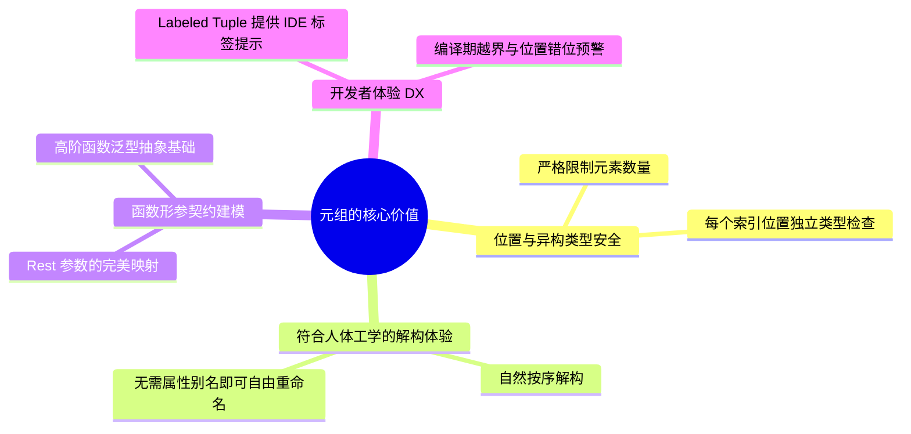
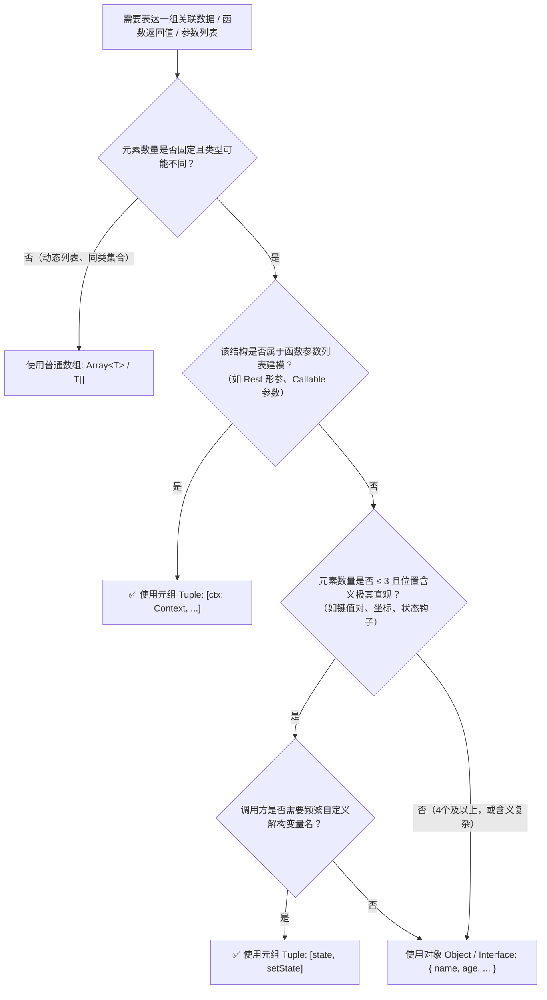

# 深入解析元组（Tuple）：价值、权衡与实践指南

## 1. 什么是元组（Tuple）？

在强类型编程语言（如 TypeScript, Rust, Python, Go, C++ 等）中，**元组（Tuple）** 是一种特殊的复合数据类型，表示**长度固定、每个位置元素类型确定且可不同的有序序列（Fixed-length, Heterogeneous Ordered Sequence）**。

简单来说：
* **普通数组（Array）**：通常表示**同构集合**，元素类型统一，长度动态可变（例如 `string[]` 或 `Array<number>`）。
* **元组（Tuple）**：表示**异构有序对**，第 0 位、第 1 位... 各自拥有独立的具体类型（例如 `[string, number, boolean]`）。

```typescript
// 数组：长度未知，所有元素均为 string
const tags: string[] = ['typescript', 'node'];

// 元组：固定 2 个元素，第 0 位必为 string，第 1 位必为 number
const entry: [key: string, value: number] = ['retryCount', 3];
```

---

## 2. 为什么需要元组？核心解决的问题与典型场景

元组在现代类型系统和架构设计中扮演着极其关键的角色，主要解决以下四个典型场景下的类型建模与开发体验问题：

### 场景一：多返回值与轻量级解构（灵活重命名）

当函数需要返回 2~3 个强相关的返回值时，元组提供了比 Object 更轻量、重命名更自然的解构体验（最典型的代表即 React `useState`）：

```typescript
// 方案 A：返回 Object
function useToggle(): { state: boolean; toggle: () => void } {
  // ...
}
// 调用方若需要多个 toggle，必须繁琐地通过冒号别名重命名
const { state: isModalOpen, toggle: toggleModal } = useToggle();
const { state: isDrawerOpen, toggle: toggleDrawer } = useToggle();

// 方案 B：返回 Tuple
function useToggle(): [state: boolean, toggle: () => void] {
  // ...
}
// 调用方可以直接任意赋予符合上下文的变量名，代码极为清爽
const [isModalOpen, toggleModal] = useToggle();
const [isDrawerOpen, toggleDrawer] = useToggle();
```

---

### 场景二：函数参数列表的类型建模（Rest Parameters & Labeled Tuples）

在框架开发（如 Cordis / Koishi 核心源码）中，高阶函数经常需要将一个函数的**参数列表**作为类型参数传递与推导。元组是 TypeScript 表达函数形参签名的唯一手段：

```typescript
// 定义通用可调用类型：R 必须是参数元组
export type Callable<T, R extends unknown[]> = 
  | ((...args: R) => T) 
  | (new (...args: R) => T)

// 在 Context.effect 中利用【具名元组（Labeled Tuple）】建模单参回调：
effect<T extends DisposableLike>(callback: Callable<T, [ctx: this]>): T
// 在多参场景中建模双参回调：
effect<T extends DisposableLike, R>(callback: Callable<T, [ctx: this, config: R]>, config: R): T
```

> **命名元组（Labeled Tuple Elements）的价值**：
> `[ctx: this, config: R]` 中的 `ctx` 和 `config` 并不是对象的 Key，而是元组各位置的**参数标签（Label）**。当开发者编写回调时，IDE 提示会直接展示 `(ctx: Context, config: R) => ...`，极大提升了代码自解释性和开发体验。

---

### 场景三：异步与批量操作的精确类型保留（Promise.all）

当并行执行多个不同类型的异步任务时，普通数组会导致类型退化为联合类型，而元组能够精确保持每个任务的返回类型：

```typescript
async function fetchUser(): Promise<User> { /* ... */ }
async function fetchConfig(): Promise<AppConfig> { /* ... */ }

// 如果没有元组（退化为 Array）：
// results 类型将变为 (User | AppConfig)[]，取值时必须手动做类型判断/断言

// 使用元组支持的 Promise.all:
const [user, config] = await Promise.all([fetchUser(), fetchConfig()]);
// ✅ user 精确推导为 User
// ✅ config 精确推导为 AppConfig
```

---

### 场景四：变长元组展开与管道组合（Variadic Tuples & Spread）

TypeScript 4.0+ 引入的**变长元组（Variadic Tuple Types）**，允许元组像数组一样进行解构与拼接，是实现中间件管道、事件监听器参数传递的核心基础：

```typescript
type EventMap = {
  'message': [userId: string, content: string],
  'login': [userId: string, timestamp: number],
}

// 变长元组展开：将事件名与事件参数元组拼接为完整函数入参
function emit<K extends keyof EventMap>(event: K, ...args: EventMap[K]) {
  // ...
}

// ✅ 严格校验参数个数与类型
emit('message', 'user_123', 'hello'); // 通过
emit('login', 'user_123');            // ❌ 报错：缺少 timestamp 参数
```

---

## 3. 元组的核心优势与价值（Pros）



1. **精准的位置类型约束（Positional Type Safety）**：
   与数组索引返回 `T | undefined` 不同，元组精确约束第 `N` 个元素的类型，杜绝类型降级为模糊的联合类型 `(A | B | C)[]`。
2. **人体工学友好的解构命名（Ergonomic Destructuring）**：
   对于轻量有序数据对（如坐标 `[x, y]`、键值对 `[key, value]`、状态钩子 `[data, setData]`），免去了对象解构时冗长的冒号别名语法。
3. **函数式与高阶类型系统的基石（Foundation for Functional Typing）**：
   利用 `[head: T, ...tail: Rest]` 可以轻松实现参数截取、柯里化（Currying）、函数组合（Compose）等高阶类型变换。
4. **自文档化的开发体验（Self-Documenting DX via Labels）**：
   借助 TypeScript 的 Labeled Tuple，既享受了元组的轻量，又保留了如对象属性一般的语义提示。

---

## 4. 元组的代价与劣势（Cons & Pitfalls）

元组虽好，但在不恰当的场景使用会导致严重的可读性和可维护性灾难：

| 痛点维度 | 具体表现 | 应对建议 |
| :--- | :--- | :--- |
| **位置语义贫乏（Position-Dependent）** | 当元素超过 3 个时（如 `[id, name, age, email, isVip]`），调用方极易混淆参数顺序，无法通过属性名直接理解含义。 | **超过 3 个字段时一律使用 Object/Interface**，通过具名字段提供自解释性。 |
| **版本演进与兼容性脆弱** | 在元组中间插入新字段或调整顺序是破坏性变更（Breaking Change），会导致所有调用方的解构位置发生错位。 | 对外公开的业务 API 优先使用对象传参；元组仅用于内部稳定结构或尾部可选参数。 |
| **类型拓宽陷阱（Type Widening）** | JavaScript 原生字面量 `['a', 1]` 默认会被 TS 拓宽推导为 `(string | number)[]` 而非元组。 | 使用 `as const` 断言显式声明为只读元组：`['a', 1] as const`。 |
| **运行时数组穿透（Runtime Array Leak）** | 元组在编译后退化为普通 JS 数组，若没有使用 `readonly` 修饰，调用 `tuple.push()` 不会被 TS 完全拦截。 | 尽可能声明为 `readonly [A, B]` 或只读变长元组。 |

---

## 5. 决策指南：什么时候用 Tuple，什么时候用 Object / Array？

### 决策流程图



### 黄金法则（Rule of Thumb）

> [!TIP]
> **元组三要素法则（The Rule of Three for Tuples）**：
> 只有当数据满足以下三点时才适合使用元组：
> 1. **数量少**：元素个数通常在 **1 ~ 3 个** 之间。
> 2. **顺序直观**：位置关系符合行业惯例（如 `[key, value]`、`[x, y]`、`[value, updater]`）。
> 3. **需要自由命名**：调用方解构时，变量名称高度依赖具体业务语境。
>
> ❌ **反模式（不应使用元组）**：
> ```typescript
> // 晦涩难记，调用方容易传反参数，后续加字段极难兼容
> function createUser(): [string, string, number, string, boolean] { ... }
> ```
> ✅ **推荐做法（改用对象）**：
> ```typescript
> interface UserProfile {
>   id: string;
>   name: string;
>   age: number;
>   email: string;
>   isActive: boolean;
> }
> function createUser(): UserProfile { ... }
> ```

---

## 6. 最佳实践总结

1. **为元组元素添加语义标签（Always Use Labeled Tuples in APIs）**：
   ```typescript
   // 推荐：给使用者清晰的 IDE 提示
   type Handler = (...args: [event: string, payload: unknown, timestamp?: number]) => void
   ```
2. **结合 `readonly` 确保不可变性（Defensive Immutability）**：
   ```typescript
   // 防止调用方误用 .push() / .pop() 破坏固定长度
   type Point = readonly [x: number, y: number];
   ```
3. **利用 `as const` 锁定元组字面量推导**：
   ```typescript
   // 自动推导为 readonly ['GET', 200]，而不是 string[]
   const response = ['GET', 200] as const;
   ```
4. **善用变长元组进行高阶类型运算**：
   ```typescript
   // 获取元组的首元素类型
   type Head<T extends readonly unknown[]> = T extends readonly [infer H, ...unknown[]] ? H : never;
   // 获取元组除首元素外的剩余部分
   type Tail<T extends readonly unknown[]> = T extends readonly [unknown, ...infer Rest] ? Rest : [];
   ```
