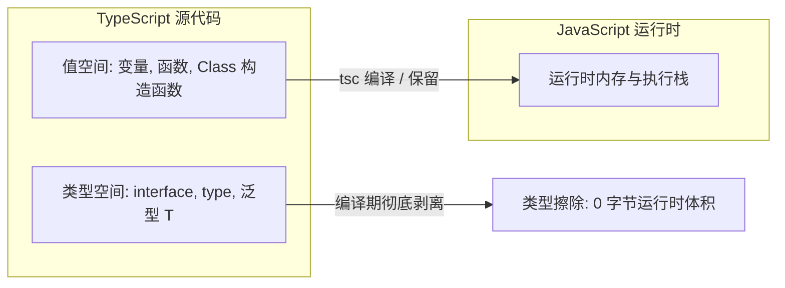
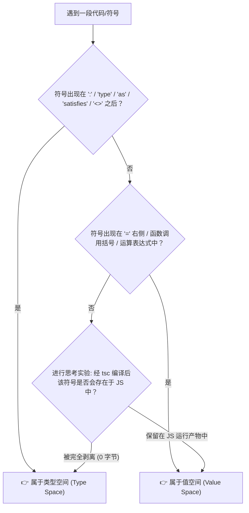
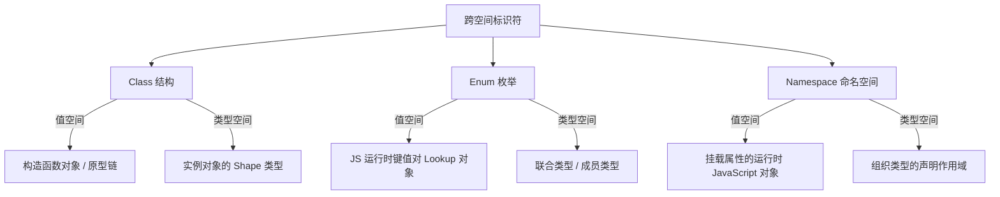
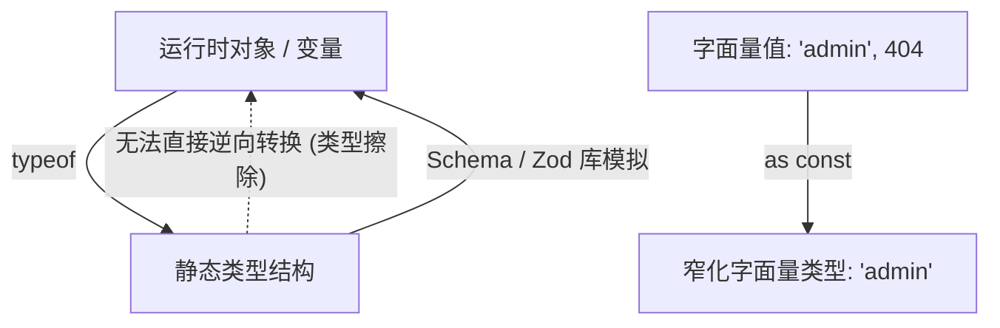
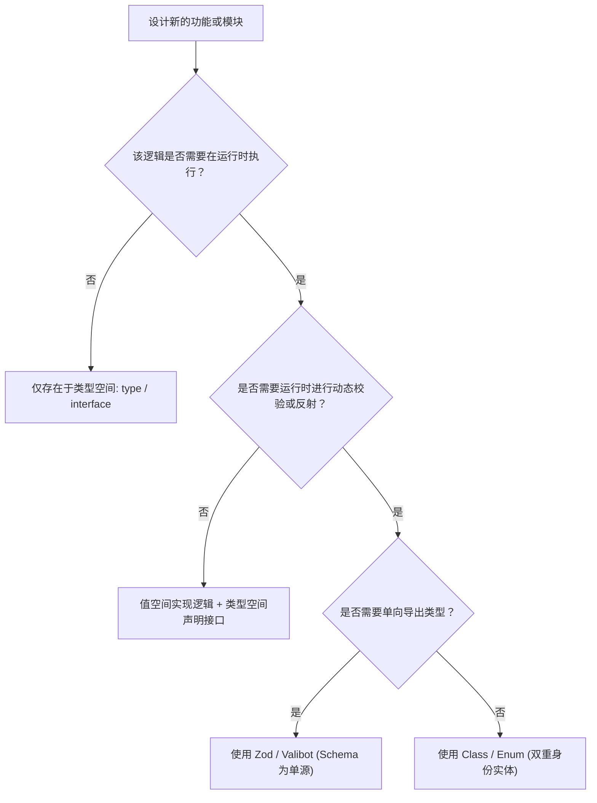

# TypeScript 核心二元性：类型空间（Type Space）与值空间（Value Space）深度解析报告

## 1. 概述与核心结论

在 TypeScript 语言体系中，存在着两个平行且相互作用的二元世界：**值空间（Value Space）**与**类型空间（Type Space）**。

在 [generic_programming_report.md](file:///d/koishi/docs/typescript/generic_programming_report.md) 中，我们探讨了泛型的核心价值与权衡，其中第 1 节指出了普通参数与泛型参数的核心差异：
* **普通函数参数**：传递的是**运行时的具体数值**（`x: 10`, `name: "Alice"`） —— 属于 **值空间**。
* **泛型类型参数**：传递的是**编译时的类型信息**（`T: number`, `T: User`） —— 属于 **类型空间**。

本文以此为切入点，系统化解构 TypeScript 中“值”与“类型”的分离、映射、双重身份以及跨空间桥接机制，帮助开发者建立清晰的双重空间心智模型。

---

## 2. 类型空间 vs 值空间：核心定义与本质区别

TypeScript 经过编译（TSC 或 Babel/ESBuild/SWC）后，所有的类型声明均会被彻底剥离（**Type Erasure / 类型擦除**），只留下纯粹的 JavaScript 代码在宿主引擎（V8, JavaScriptCore 等）中运行。



| 维度 | 值空间（Value Space） | 类型空间（Type Space） |
| :--- | :--- | :--- |
| **存在阶段** | 编译期 + **运行时（Runtime）** | **仅编译期（Compile-time）** |
| **产物影响** | 最终打包进 JavaScript 物理文件（占体积） | 被完全擦除（零运行时体积与开销） |
| **主要语法元素** | `const`, `let`, `var`, `function`, `class` (构造器), 普通表达式, 运行时 `typeof`, `instanceof` | `type`, `interface`, `generic <T>`, `keyof`, `readonly` (修饰符), `infer`, 类型 `typeof` |
| **计算引擎** | JavaScript 引擎（V8, SpiderMonkey） | TypeScript 类型检查器（Type Checker / AST 递归推导） |
| **错误捕获** | 运行时异常（`TypeError`, `ReferenceError`） | 编译期静态报错（IDE 红线提示） |

---

## 3. 快速判别法则：如何秒测符号与语法所处空间？

在日常阅读或编写复杂 TypeScript 代码时，可以通过以下四大核心法则瞬间判定某段语法或符号到底处于哪个空间：



### 法则一：语法位置与上下文边界标记（Contextual Syntax Tokens）

TypeScript 的语法结构具有明确的空间上下文，特定关键字和标点符号即为空间边界的分水岭：

| 标记符号 / 关键字 | 上下文类型 | 典型示例 | 判定归属 |
| :--- | :--- | :--- | :--- |
| `:` (类型注解后) | 类型上下文 | `const x: User = ...` | `User` 属于 **类型空间** |
| `type` / `interface` 之后 | 类型声明 | `type ID = string \| number` | 整个表达式属于 **类型空间** |
| `< ... >` (尖括号内) | 泛型/类型参数 | `Promise<Response>`、`Map<K, V>` | 尖括号内部属于 **类型空间** |
| `as` / `satisfies` 之后 | 类型断言/匹配 | `val as Config`、`opts satisfies Opts` | `Config` / `Opts` 属于 **类型空间** |
| `is` 之后 | 自定义类型守卫 | `function isUser(a: any): a is User` | `User` 属于 **类型空间** |
| `=` (等号赋值右侧) | 表达式求值 | `const x = calculateTotal()` | `calculateTotal()` 属于 **值空间** |
| `(...)` (函数实参列表) | 运行时入参 | `fetchUser(userId, 10)` | `userId`, `10` 属于 **值空间** |
| `new` 之后 | 实例化构造器 | `new Date()`、`new Person()` | `Date` / `Person` 处于 **值空间** 角色 |
| 算术 / 逻辑 / 条件运算符 | 运行时运算 | `a + b`、`x && y`、`flag ? 1 : 0` | 所有操作数均属于 **值空间** |

---

### 法则二：“编译擦除”思考实验（The Type Erasure Mental Test）

如果你不确定某行代码中的某个单词到底属于哪个空间，可以在脑海中做一个极简的**语法擦除实验**：

> [!TIP]
> **思考实验**：
> 假设将这段代码交给 Babel、SWC 或 ESBuild（它们只纯粹按语法规则抹掉类型，不做任何类型系统推导）：
> * **被完全抹掉、在输出的 `.js` 文件中消失的内容** $\rightarrow$ **类型空间**。
> * **被原封不动保留在 `.js` 文件中参与运行的内容** $\rightarrow$ **值空间**。

```typescript
// TS 源码
const count: number = 42;
//    ^^^^^           ^^
// 擦除后保留(值)   擦除后保留(值)
//           ^^^^^^
//        被彻底擦除(类型)

// 经过擦除后的 JS 产物：
const count = 42;
```

---

### 法则三：“能否 console.log” 运行时求值法则（Runtime Evaluation Test）

尝试在代码中将该标识符直接传入 `console.log(SYMBOL)`：

1. **纯类型空间符号**：
   ```typescript
   interface User { name: string; }
   type Status = "active" | "inactive";

   console.log(User);   // ❌ 编译报错: 'User' only refers to a type, but is being used as a value here.
   console.log(Status); // ❌ 编译报错: 'Status' only refers to a type, but is being used as a value here.
   ```
2. **值空间符号（或具备双重身份的符号）**：
   ```typescript
   class Person {}
   enum Mode { Fast }
   const name = "Alice";

   console.log(Person); // ✅ 正常输出: [class Person]
   console.log(Mode);   // ✅ 正常输出: { '0': 'Fast', Fast: 0 }
   console.log(name);   // ✅ 正常输出: "Alice"
   ```

---

### 法则四：多义语法操作符的“位置决定论”（Dual-Role Operators）

同一符号在不同的位置会扮演完全不同的角色，切忌仅凭单词表面判断：

```typescript
// 1. typeof 的双重身份
const user = { name: "Bob", age: 18 };
const runtimeType = typeof user;        // 位于等号右侧表达式中 -> 【值空间】(JS 原生 typeof，返回 "object")
type StaticType   = typeof user;        // 位于 type 声明等号右侧 -> 【类型空间】(TS 类型查询，推导出 { name: string; age: number })

// 2. { } 花括号的双重身份
const obj  = { key: "value" };          // 值空间: 对象字面量
type Dict  = { key: string };           // 类型空间: 对象类型签名

// 3. [ ] 中括号的双重身份
const item = list[0];                   // 值空间: 数组索引读取值
type Element = string[];                // 类型空间: 数组类型
type Val = Dict["key"];                 // 类型空间: 索引访问类型 (Indexed Access Type)

// 4. | 与 & 的双重身份
const bitwise = 1 | 2;                  // 值空间: 按位或运算
type Union    = number | string;        // 类型空间: 联合类型
```

---

## 4. 双重身份与名称重叠（Dual-Identity & Scope Shadowing）

TypeScript 允许某些符号在**值空间**和**类型空间**中同时存在，或者使用相同的名称标识不同的实体。

### 4.1 具有双重身份的语言结构

有三大核心结构在 TS 中天然跨越两个空间：



#### 1. `class`（类）
```typescript
class Person {
  name: string = "Alice";
  sayHello() { console.log(this.name); }
}

// 1. 在值空间使用：Person 是一个具体的构造函数值
const pVal = new Person(); 
console.log(Person.name); // 输出 "Person"

// 2. 在类型空间使用：Person 代表该类实例的静态类型结构
type PersonInstance = Person; // 等价于 { name: string; sayHello(): void }
function greet(p: Person) { p.sayHello(); }
```

#### 2. `enum`（枚举）
```typescript
enum Status {
  Success = 200,
  NotFound = 404,
}

// 1. 值空间：Status 被编译为一个真实的 JavaScript 对象
console.log(Status.Success); // 200

// 2. 类型空间：Status 作为成员联合类型
function handleStatus(s: Status) { /* ... */ }
```

> [!WARNING]
> **Enum 的打包代价**：由于 `enum` 在值空间会生成运行时代码，违背了 TS "仅作为类型补充" 的初衷。现代最佳实践往往推荐使用 `const` 对象结合 `as const` 来替代非必要的 `enum`。

### 4.2 同名符号的独立存在（Namespace Collisions Allowed）

在 TypeScript 中，**值空间名称**与**类型空间名称**存放在独立的符号表中，因此同名的 `const` 和 `type` 可以合法共存：

```typescript
// 类型空间中的 User
type User = {
  id: string;
  name: string;
};

// 值空间中的 User (如作为默认工厂对象或常量)
const User = {
  create(name: string): User {
    return { id: "1", name };
  }
};

// 使用场景区别：
const u: User = User.create("Bob");
//    ^           ^
// 类型空间      值空间
```

---

## 5. 跨空间转换与桥接机制（Bridge Operators）

TypeScript 提供了若干操作符与设计模式，用于在两个空间之间传递信息与推导类型。



### 5.1 从值空间提炼至类型空间（Value -> Type）

#### 1. `typeof` 双重意图
`typeof` 是 TS 中最容易混淆的操作符，因为其在两个空间有完全不同的语义：

```typescript
const config = { host: "localhost", port: 8080 };

// A. 值空间中的 typeof (JavaScript 原生操作符，返回字符串)
const jsType = typeof config; // 运行时结果: "object"

// B. 类型空间中的 typeof (TypeScript 类型查询操作符)
type ConfigType = typeof config; 
// 编译期推导结果: { host: string; port: number }
```

#### 2. `keyof typeof` 模式
组合使用 `keyof` 与 `typeof` 可以将值空间对象的键转化为类型空间中的字面量联合类型：

```typescript
const ThemeColors = {
  primary: "#007bff",
  danger: "#dc3545",
  success: "#28a745",
} as const;

// 提炼出 "primary" | "danger" | "success" 联合类型
type ThemeColorKey = keyof typeof ThemeColors;
```

#### 3. `ReturnType<typeof fn>`
获取值空间中某个函数的返回值为类型：

```typescript
function buildUser() {
  return { id: 101, roles: ["admin", "user"] };
}

// 抽取函数返回值的类型空间表达
type UserPayload = ReturnType<typeof buildUser>;
```

### 5.2 值空间字面量向类型空间的精确映射：`as const`

默认情况下，值空间中的变量会被类型空间**拓宽（Type Widening）**：

```typescript
let role = "admin"; // 类型空间推导为: string (可变)

const roleConst = "admin" as const; 
// 类型空间推导为精确的字面量类型: "admin" (只读不可变)
```

### 5.3 为什么无法直接“从类型空间到值空间”？

开发者经常会写出如下错误代码：

```typescript
interface NetworkError {
  code: number;
}

function handle(err: unknown) {
  // ❌ 编译报错：NetworkError 仅存在于类型空间，运行时不存在此标识符！
  if (err instanceof NetworkError) { ... } 
}
```

#### 解决方案：Schema 验证库（如 Zod / Valibot）
由于 TS 类型在编译后消失，运行时校验需要依靠能够同时在值空间生成校验函数、在类型空间导出类型的工具：

```typescript
import { z } from "zod";

// 1. 在值空间定义 Schema (运行时校验对象)
export const UserSchema = z.object({
  id: z.string(),
  name: z.string(),
});

// 2. 从值空间 Schema 自动反向推导类型空间类型 (单向数据源)
export type User = z.infer<typeof UserSchema>;
```

---

## 6. 从二元空间视角看泛型编程（结合 `generic_programming_report.md`）

参照 [generic_programming_report.md](file:///d/koishi/docs/typescript/generic_programming_report.md) 中的分析，泛型本质上是在**类型空间**中执行的“函数”与“计算”。

### 6.1 值空间计算 vs 类型空间计算

```typescript
// -------------------------------------------------------------
// 1. 值空间计算 (JavaScript 运行时逻辑)
// -------------------------------------------------------------
function concatValues(a: string, b: string): string {
  return a + "_" + b;
}
const valResult = concatValues("hello", "world"); // "hello_world"

// -------------------------------------------------------------
// 2. 类型空间计算 (TypeScript 类型体操 / 编译期元编程)
// -------------------------------------------------------------
type ConcatTypes<A extends string, B extends string> = `${A}_${B}`;
type TypeResult = ConcatTypes<"hello", "world">; // "hello_world" (编译期直接推导出的类型)
```

### 6.2 泛型二元性对比表

| 对比维度 | 值空间表达式 | 类型空间泛型表达式 |
| :--- | :--- | :--- |
| **入参传递** | `fn(arg1, arg2)` | `GenericFn<T1, T2>` |
| **条件判断** | `if (x) { ... } else { ... }` | `T extends U ? TrueType : FalseType` |
| **模式匹配/提取** | 解构赋值 `const [first] = arr` | `T extends Array<infer Item> ? Item : never` |
| **循环/迭代** | `for ... of`, `map()` | 深度递归类型 `[T, ...Recursive<Rest>]` |
| **性能代价** | CPU 周期、内存占用、GC 垃圾回收 | TSC 编译时长、内存消耗、`Type instantiation is excessively deep` |

### 6.3 从二元空间看 generic_programming_report.md 中的黄金法则

在 [generic_programming_report.md](file:///d/koishi/docs/typescript/generic_programming_report.md) 第 5 节中提出了**泛型单次出现反模式（Single-Occurrence Anti-Pattern）**：

> [!IMPORTANT]
> **反模式示例**：
> ```typescript
> function printName<T extends { name: string }>(item: T): void {
>   console.log(item.name);
> }
> ```

**从二元空间维度的解读**：
在该例子中，开发者引入了类型空间参数 `T`，但 `T` 在类型空间中没有与任何其他类型参数或返回值产生**交织关系（Type-level Interlocking）**。此函数仅在**值空间**读取 `item.name` 属性，因此根本不需要在类型空间开辟多余的泛型变量。直接声明具体结构 `{ name: string }` 即可减少类型检查器的状态维护开销。

---

## 7. 常见误区与避坑指南

### 误区一：混淆 `instanceof` 与 `interface`
* `instanceof` 是**值空间**操作符，右侧必须是一个具体的类构造函数。
* `interface` 仅属于**类型空间**。不能写 `x instanceof MyInterface`。

### 误区二：在泛型函数内部尝试读取类型参数的值
```typescript
function process<T>(input: T) {
  // ❌ 错误：T 在运行时已被擦除，无法当做值空间变量访问
  console.log(T); 
  if (typeof input === T) { ... }
}
```

### 误区三：滥用类型断言 `as` 导致空间断层（Type Lies）
使用 `as` 强转时，相当于告诉编译器：“忽略类型空间的推导，强制将其指定为此类型”。如果值空间的实际结构与类型空间声明不符，会导致运行时静默崩溃：

```typescript
// ⚠️ 极其危险：值空间是空对象，但类型空间被欺骗为 User
const user = {} as User;
console.log(user.name.toUpperCase()); // 💥 运行时 TypeError: Cannot read properties of undefined
```

---

## 8. 最佳实践与二元空间设计决策树

在设计 API 或工具库时，可参考以下决策树来规划代码在值空间与类型空间的权衡：



### 总结三要义

1. **清晰划清边界**：随时感知当前编写的代码属于**编译期类型空间**还是**运行时值空间**。
2. **警惕类型擦除**：永远不要在运行时代码逻辑中依赖仅存在于类型空间的元素（如 interface、type alias）。
3. **精准桥接空间**：合理使用 `typeof`、`keyof`、`as const` 与 Schema 校验工具，实现值空间与类型空间的安全联动。
